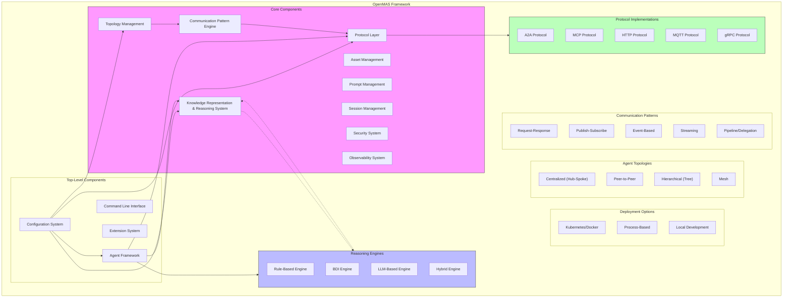
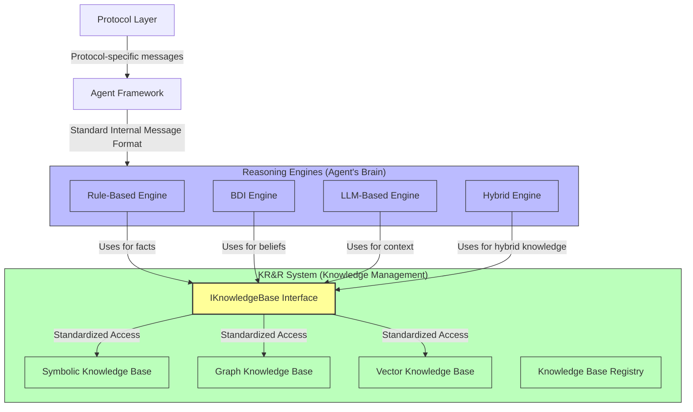
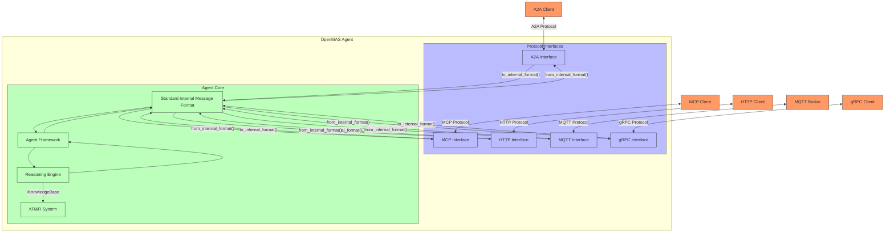
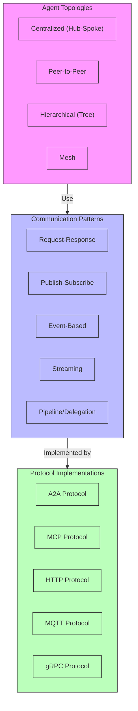
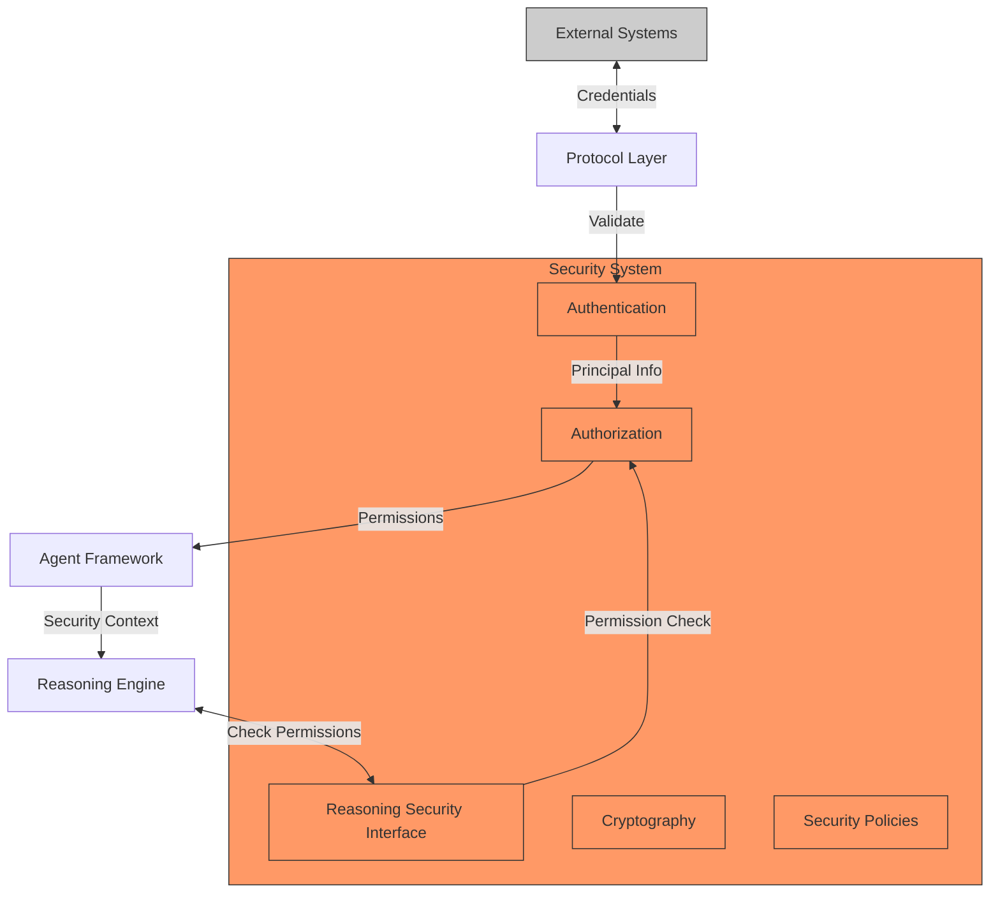
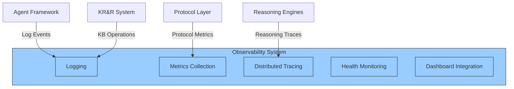

# OpenMAS Architecture Diagrams

This document contains the architectural diagrams referenced in the [Architecture Overview](./architecture_overview.md) document. Centralizing diagrams in this file improves maintainability and organization.

## High-Level Component Architecture

The following diagram illustrates the high-level component architecture of OpenMAS v0.3.0:

### Key Components Relationships

This diagram highlights the critical relationships between the KR&R System and Reasoning Engines:

## Protocol Integration Architecture

The diagram below illustrates how OpenMAS supports multiple protocols simultaneously:

## Topology and Communication Patterns

The following diagram shows the relationship between agent topologies and communication patterns:

## Security Architecture

The security architecture integrates with all components:

## Observability Architecture

The observability architecture provides monitoring and debugging capabilities:

These diagrams provide a visual representation of the OpenMAS v0.3.0 architecture and its key components.
