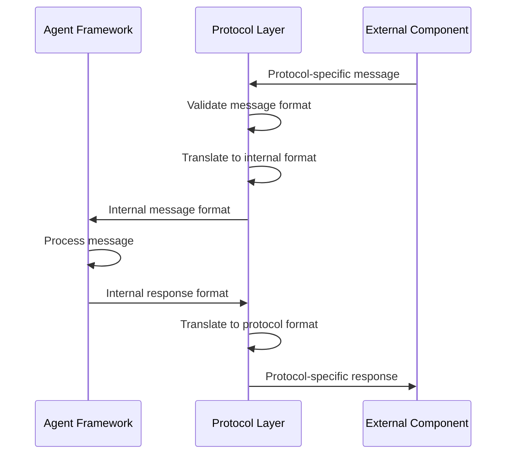
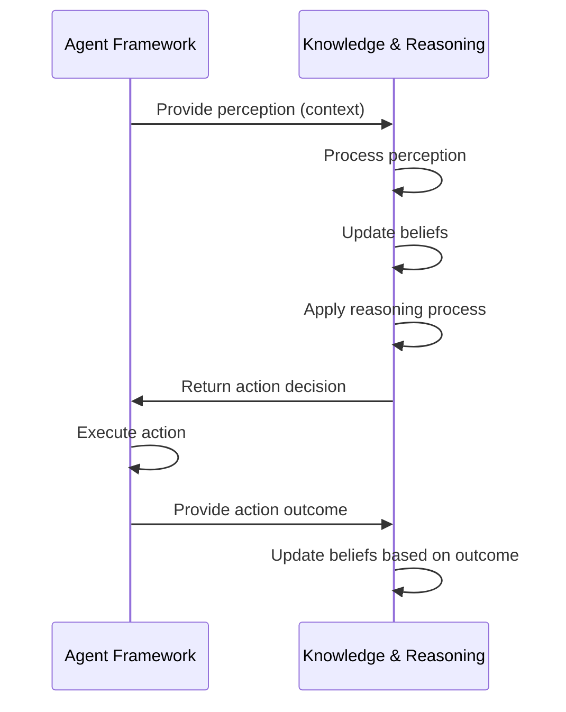
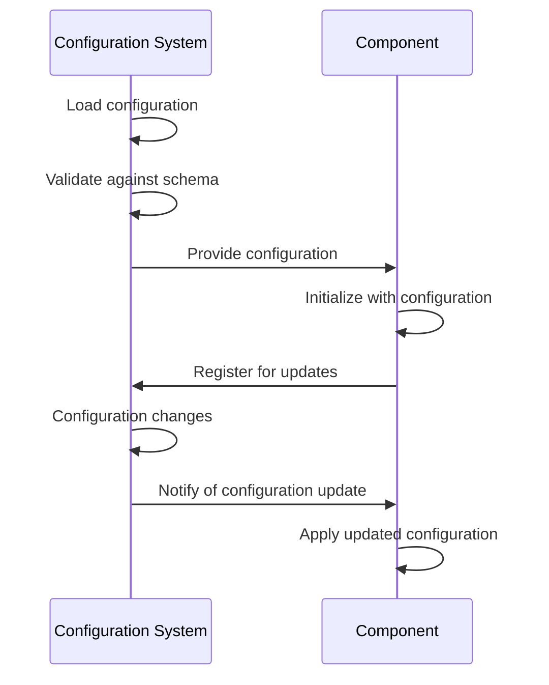
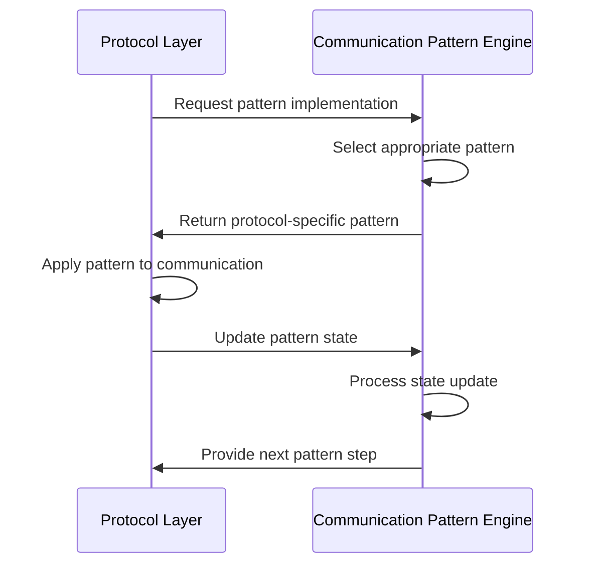
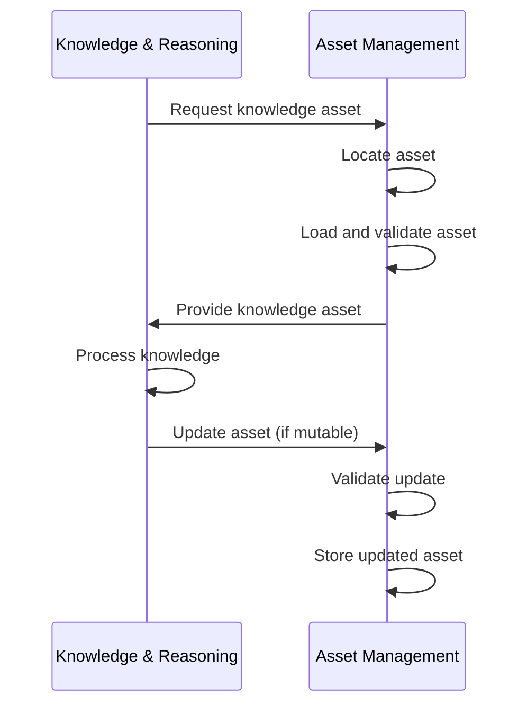
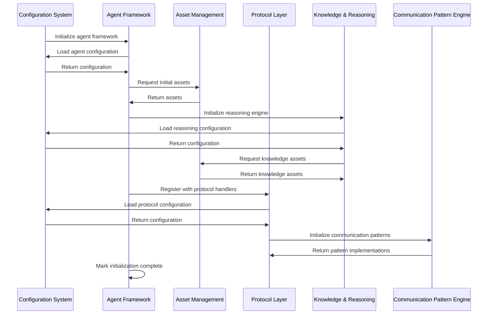
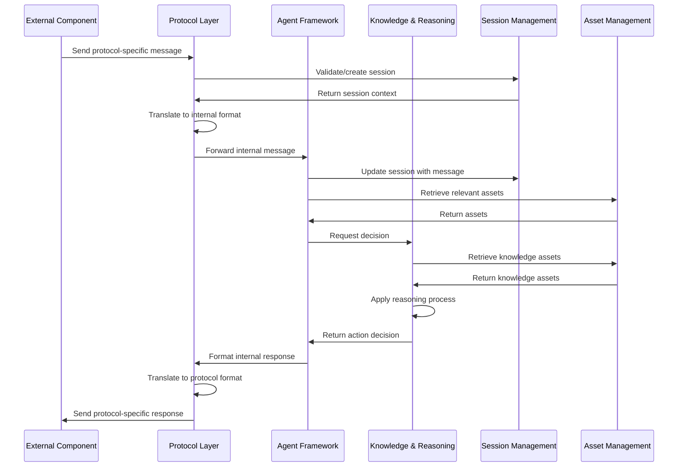
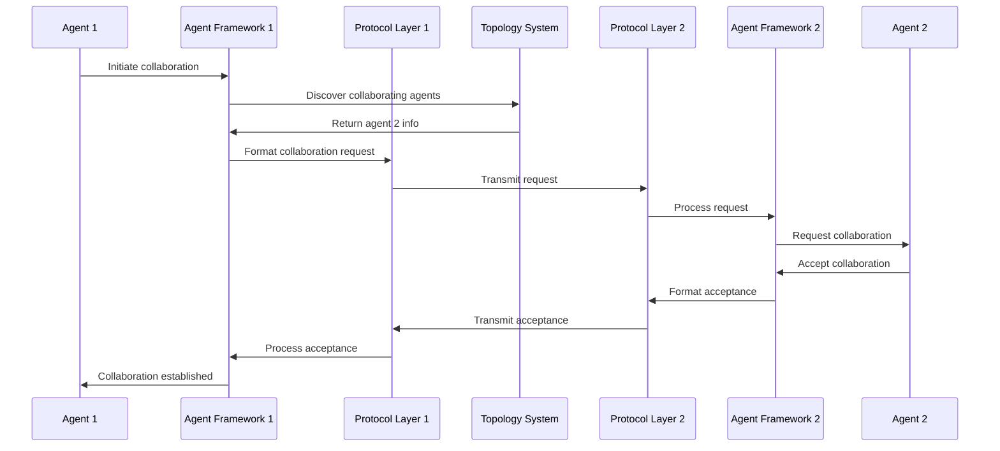

# Comprehensive Component Interactions

This document provides a detailed overview of how components interact within the OpenMAS framework. It serves as a single source of truth for component interoperability, clearly defining interaction patterns, component boundaries, and cross-component workflows.

## Overview of Component Interaction Architecture

OpenMAS follows these key principles for component interactions:

1. **Clear Interface Contracts**: Components interact through well-defined interfaces rather than direct implementation dependencies
2. **Dependency Injection**: Components receive their dependencies through constructor injection or configuration
3. **Event-Driven Communication**: Many cross-component interactions happen through an event system
4. **Configuration-Driven Assembly**: Component relationships are defined through configuration
5. **Minimal Dependencies**: Components have the minimum necessary dependencies to function
6. **Extension Points**: Components provide clear extension mechanisms for customization

### Core Interaction Mechanisms

Components in OpenMAS interact through:

1. **Direct Method Calls**: Synchronous method calls via interface contracts
2. **Events**: Asynchronous event publication and subscription
3. **Shared Configuration**: Common configuration that affects multiple components
4. **Extension Registration**: Components extending functionality of other components
5. **Resource Sharing**: Managed access to shared resources (state, assets, etc.)

## Component Interaction Patterns

### 1. Agent Framework ↔ Protocol Layer

The Agent Framework and Protocol Layer interaction represents a critical boundary between agent functionality and protocol-specific communication.

#### Interaction Flow



#### Interface Contracts

1. **Protocol Layer → Agent Framework**:
   ```python
   # The Protocol Layer calls these methods on the Agent Framework
   class AgentMessageHandler:
       def handle_message(self, message: InternalMessage) -> InternalResponse:
           # Process the message according to agent capabilities
           pass

       def register_capability(self, capability: Capability) -> bool:
           # Register a capability that can be discovered via protocol
           pass
   ```

2. **Agent Framework → Protocol Layer**:
   ```python
   # The Agent Framework calls these methods on the Protocol Layer
   class ProtocolHandler:
       def send_message(self, message: InternalMessage, target: TargetInfo) -> bool:
           # Send a message via the protocol
           pass

       def advertise_capability(self, capability: Capability) -> bool:
           # Make a capability available via the protocol
           pass
   ```

#### Implementation Considerations

1. **Protocol Independence**: The Agent Framework must operate without knowledge of protocol-specific details
2. **Translation Responsibility**: The Protocol Layer is responsible for all translation between internal and protocol-specific formats
3. **Capability Mapping**: The Protocol Layer maps internal capabilities to protocol-specific capability formats
4. **Error Handling**: Protocol-specific errors must be translated to internal error formats before reaching the Agent Framework

### 2. Agent Framework ↔ Knowledge & Reasoning (KR&R)

This interaction represents the critical "body-brain separation" at the core of OpenMAS's reasoning agnostic architecture.

#### Interaction Flow



#### Interface Contracts

1. **Agent Framework → KR&R**:
   ```python
   # The Agent Framework calls these methods on the KR&R component
   class ReasoningEngine:
       def decide_action(self, context: Context) -> Action:
           # Determine appropriate action based on context
           pass

       def update_perception(self, perception: Perception) -> None:
           # Update internal knowledge based on new perception
           pass

       def evaluate_goal(self, goal: Goal, context: Context) -> GoalStatus:
           # Evaluate if a goal is achieved or achievable
           pass
   ```

2. **KR&R → Agent Framework**:
   ```python
   # The KR&R component calls these methods on the Agent Framework
   class ActionExecutor:
       def execute_action(self, action: Action) -> ActionResult:
           # Execute an action determined by the reasoning engine
           pass

       def register_belief_update(self, belief: Belief) -> None:
           # Notify agent framework of a significant belief update
           pass
   ```

#### Implementation Considerations

1. **Reasoning Independence**: The Agent Framework must operate without knowledge of the specific reasoning mechanism
2. **Context Standardization**: Perception data must be converted to a standard context format before passing to KR&R
3. **Action Abstraction**: Actions returned by KR&R must be abstract enough to be interpreted by any agent implementation
4. **Multiple Reasoning Support**: The interface must support different reasoning paradigms (rule-based, BDI, LLM, hybrid)

### 3. Configuration System ↔ All Components

The Configuration System interacts with all other components, providing configuration data and validation.

#### Interaction Flow



#### Interface Contracts

1. **Configuration System → Components**:
   ```python
   # The Configuration System calls these methods on Components
   class ConfigurableComponent:
       def configure(self, config: Dict[str, Any]) -> None:
           # Apply configuration to component
           pass

       def notify_config_update(self, updated_keys: List[str]) -> None:
           # Notify component of configuration changes
           pass
   ```

2. **Components → Configuration System**:
   ```python
   # Components call these methods on the Configuration System
   class ConfigurationProvider:
       def get_config(self, component_path: str) -> Dict[str, Any]:
           # Get configuration for a specific component
           pass

       def register_schema(self, component_path: str, schema: Schema) -> None:
           # Register validation schema for component
           pass

       def subscribe_to_updates(self, component_path: str, callback: Callable) -> None:
           # Subscribe to configuration updates
           pass
   ```

#### Implementation Considerations

1. **Configuration Hierarchies**: Components inherit configuration from parent paths
2. **Schema Validation**: All components must register schemas for their configuration
3. **Dynamic Updates**: Components must handle dynamic configuration updates gracefully
4. **Defaults**: The Configuration System provides sensible defaults for missing values

### 4. Protocol Layer ↔ Communication Pattern Engine

This interaction handles the adaptation of communication patterns to specific protocols.

#### Interaction Flow



#### Interface Contracts

1. **Protocol Layer → Communication Pattern Engine**:
   ```python
   # The Protocol Layer calls these methods on the Communication Pattern Engine
   class PatternProvider:
       def get_pattern(self, pattern_type: str, protocol: str) -> Pattern:
           # Get a pattern implementation for a specific protocol
           pass

       def update_pattern_state(self, pattern_id: str, state_update: Dict[str, Any]) -> None:
           # Update the state of an active pattern
           pass
   ```

2. **Communication Pattern Engine → Protocol Layer**:
   ```python
   # The Communication Pattern Engine calls these methods on the Protocol Layer
   class ProtocolPatternAdapter:
       def apply_pattern_formatting(self, message: Message, pattern: Pattern) -> Message:
           # Apply pattern-specific formatting to a message
           pass

       def validate_pattern_compliance(self, message: Message, pattern: Pattern) -> bool:
           # Validate that a message complies with a pattern
           pass
   ```

#### Implementation Considerations

1. **Protocol-Specific Adaptations**: Patterns must be adapted to each protocol's capabilities
2. **Pattern State Management**: The Communication Pattern Engine maintains pattern state
3. **Protocol Constraints**: Patterns must respect the limitations of each protocol
4. **Pattern Transitions**: Complex interactions may transition between multiple patterns

### 5. Asset Management ↔ Knowledge & Reasoning (KR&R)

This interaction handles the provision of knowledge assets to reasoning components.

#### Interaction Flow



#### Interface Contracts

1. **KR&R → Asset Management**:
   ```python
   # The KR&R component calls these methods on the Asset Management
   class AssetProvider:
       def get_asset(self, asset_id: str, asset_type: str) -> Asset:
           # Retrieve an asset by ID and type
           pass

       def search_assets(self, query: Query) -> List[Asset]:
           # Search for assets matching query
           pass

       def update_asset(self, asset_id: str, update: Dict[str, Any]) -> bool:
           # Update a mutable asset
           pass
   ```

2. **Asset Management → KR&R**:
   ```python
   # The Asset Management calls these methods on the KR&R component
   class AssetConsumer:
       def notify_asset_update(self, asset_id: str) -> None:
           # Notify that an asset has been updated
           pass

       def validate_asset_update(self, asset_id: str, update: Dict[str, Any]) -> bool:
           # Validate a proposed asset update
           pass
   ```

#### Implementation Considerations

1. **Asset Versioning**: Assets are versioned to maintain consistency
2. **Caching**: Frequently used assets are cached for performance
3. **Asset Types**: Different knowledge representations require different asset types
4. **Asset References**: Knowledge assets can reference other assets

## Cross-Component Workflows

### 1. Agent Initialization Workflow

This workflow illustrates how an agent is initialized across multiple components.



### 2. Message Processing Workflow

This workflow illustrates how a message is processed across multiple components.



### 3. Multi-Agent Collaboration Workflow

This workflow illustrates interaction between multiple agents.



## Component Coupling Analysis

This section analyzes the coupling level between components to ensure appropriate separation of concerns.

### Coupling Analysis Matrix

| Component Pair | Coupling Type | Coupling Level | Justification |
|----------------|---------------|----------------|---------------|
| Agent Framework ↔ Protocol Layer | Interface | Medium | Necessary for protocol-agnostic communication |
| Agent Framework ↔ KR&R | Interface | Medium | Necessary for reasoning-agnostic operation |
| Configuration System ↔ All Components | Configuration | Low | One-way dependency through configuration |
| Protocol Layer ↔ Communication Pattern Engine | Interface | Medium | Necessary for pattern-based communication |
| Agent Framework ↔ Topology System | Interface | Medium | Necessary for agent discovery and organization |
| KR&R ↔ Asset Management | Interface | Medium | Necessary for knowledge asset access |
| Extension System ↔ All Components | Extension Points | Low | Loose coupling through extension interfaces |

### Interface Abstraction Quality

1. **Agent Framework ↔ Protocol Layer**: High
   - Clear separation between agent functionality and protocol details
   - Protocol-specific details entirely encapsulated in Protocol Layer
   - Protocol adapter pattern provides clean abstractions

2. **Agent Framework ↔ KR&R**: High
   - Clean separation between agent "body" and "brain"
   - Standard context and action formats regardless of reasoning implementation
   - Multiple reasoning approaches can be used interchangeably

3. **Protocol Layer ↔ Communication Pattern Engine**: Medium
   - Some protocol-specific details leak into pattern implementations
   - Pattern abstractions need more standardization across protocols
   - Clear extension mechanisms for new patterns

4. **KR&R ↔ Asset Management**: Medium
   - Asset types are somewhat coupled to knowledge representation formats
   - Clear interfaces for asset retrieval and update
   - Extension mechanisms for new asset types

### Extensibility Analysis

1. **Agent Framework**:
   - Extension points for new agent types
   - Extension points for new capability types
   - Extension points for agent lifecycle hooks

2. **Protocol Layer**:
   - Extension points for new protocol adapters
   - Extension points for protocol-specific message handlers
   - Extension points for protocol security mechanisms

3. **Knowledge & Reasoning**:
   - Extension points for new reasoning engines
   - Extension points for knowledge representation formats
   - Extension points for belief management strategies

4. **Communication Pattern Engine**:
   - Extension points for new communication patterns
   - Extension points for pattern implementations
   - Extension points for protocol-specific pattern adaptations

## Component Boundary Definitions

This section defines clear boundaries between components, clarifying responsibilities and non-responsibilities.

### Agent Framework Boundaries

**Responsibilities**:
- Agent lifecycle management
- Message routing between components
- Capability registration and invocation
- Event distribution
- Action execution

**Non-Responsibilities**:
- Protocol-specific message formatting
- Reasoning logic
- Knowledge representation
- Asset storage

### Protocol Layer Boundaries

**Responsibilities**:
- Protocol-specific message formatting
- Protocol connection management
- Protocol capability advertisement
- Protocol security implementation
- Message translation

**Non-Responsibilities**:
- Agent lifecycle management
- Reasoning logic
- Message routing between agents
- Asset management

### Knowledge & Reasoning Boundaries

**Responsibilities**:
- Decision making logic
- Knowledge representation
- Belief management
- Goal evaluation
- Planning

**Non-Responsibilities**:
- Protocol communication
- Asset storage
- Message routing
- Agent lifecycle management

### Configuration System Boundaries

**Responsibilities**:
- Configuration loading and validation
- Configuration distribution
- Schema management
- Environment variable integration
- Dynamic configuration updates

**Non-Responsibilities**:
- Component initialization
- Security enforcement
- Component-specific logic
- Configuration storage

## Implementation Guidelines

### Interface Design Guidelines

1. **Use Abstract Base Classes**: Define core interfaces as abstract base classes with proper type annotations
2. **Minimize Interface Size**: Each interface should have minimal methods needed for the interaction
3. **Clear Method Signatures**: Method parameters and return types should be clearly defined
4. **Documentation**: All interfaces should include comprehensive docstrings
5. **Versioning**: Interface changes should follow semantic versioning principles

### Dependency Injection Guidelines

1. **Constructor Injection**: Dependencies should be injected through constructors
2. **Default Implementations**: Provide sensible defaults for optional dependencies
3. **Configuration-Based Injection**: Use configuration to determine concrete implementations
4. **Lazy Initialization**: Initialize dependencies only when needed
5. **Clear Dependencies**: Document all dependencies in class documentation

### Event-Based Communication Guidelines

1. **Event Definitions**: Clearly define event types and payloads
2. **Subscription Mechanisms**: Provide clean subscription and unsubscription mechanisms
3. **Error Handling**: Handle event delivery failures gracefully
4. **Performance Considerations**: Optimize for high-frequency events
5. **Documentation**: Document event flows and expected subscribers

### Error Handling Guidelines

1. **Error Types**: Define specific error types for different failure scenarios
2. **Recovery Strategies**: Document recovery strategies for each error type
3. **Error Propagation**: Define how errors propagate between components
4. **Logging**: Log errors with appropriate context for debugging
5. **Fallback Mechanisms**: Provide fallback mechanisms for critical failures

## Conclusion

This comprehensive documentation of component interactions provides a clear guide for implementing and extending the OpenMAS framework. By following these interaction patterns and guidelines, developers can ensure that components work together seamlessly while maintaining the core principles of reasoning agnosticism and protocol independence.

For more detailed information on specific component interactions, refer to the individual interaction documents:

- [Agent Framework ↔ KR&R](./interactions/agent_framework_krr.md)
- [Agent Framework ↔ Protocol Layer](./interactions/agent_framework_protocol_layer.md)
- [Configuration System ↔ Agent Framework](./interactions/configuration_system_agent_framework.md)
- And other individual interaction documents

The [Component Matrix](./component_matrix.md) provides a high-level overview of all component relationships, while [Workflow Diagrams](./workflow_diagrams.md) illustrates end-to-end processes across components. [Component Boundaries](./component_boundaries.md) defines the clear responsibilities of each component.
