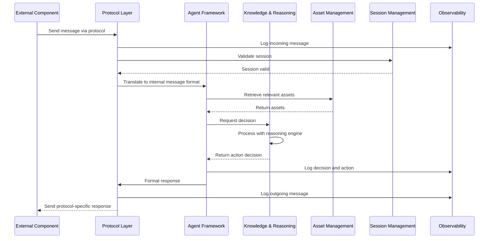
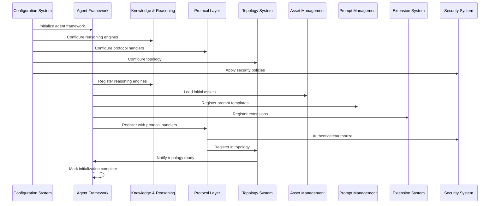
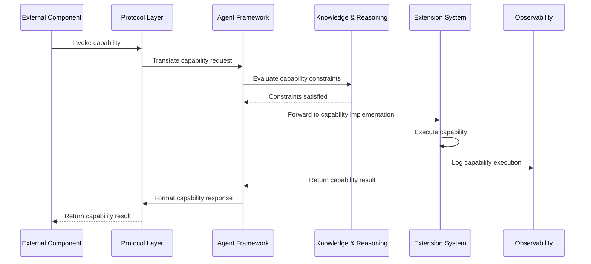
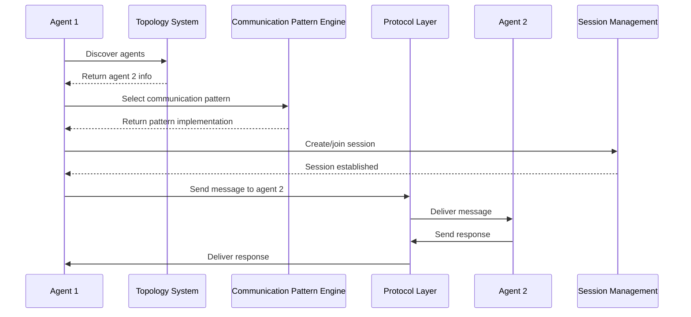
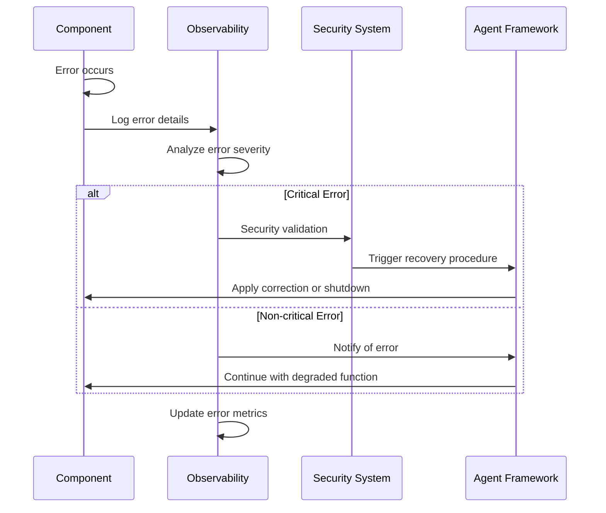

# OpenMAS End-to-End Workflows

This document illustrates complete workflows that span multiple OpenMAS components, providing a comprehensive view of how components interact in key operational scenarios.

## Agent Message Processing Workflow

### Workflow Steps:
1. **Message Reception**: External component sends a message using a specific protocol (A2A, MCP, HTTP, MQTT, gRPC)
2. **Protocol Translation**: Protocol Layer receives the message, logs it, validates the session, and translates it to the internal OpenMAS message format
3. **Asset Retrieval**: Agent Framework requests any necessary assets (knowledge bases, prompts, etc.) from Asset Management
4. **Decision Making**: Agent Framework delegates decision-making to the Knowledge Representation & Reasoning component
5. **Response Generation**: Based on the decision, an appropriate response is generated
6. **Response Delivery**: The response is formatted according to the protocol and sent back to the external component
7. **Observability**: Throughout the process, key events are logged for monitoring and debugging

## Agent Initialization Workflow

### Workflow Steps:
1. **Configuration Loading**: Configuration System loads and validates all configuration parameters
2. **Component Initialization**: Each core component is initialized with its configuration
3. **Registration Phase**: Components register their capabilities with each other
4. **Security Setup**: Security policies are applied across components
5. **Topology Establishment**: Agent relationships and communication paths are established
6. **Readiness Signaling**: Components signal readiness to the Agent Framework

## Capability Invocation Workflow

### Workflow Steps:
1. **Capability Request**: External component requests a capability invocation 
2. **Request Translation**: Protocol Layer translates the request to the internal format
3. **Constraint Evaluation**: Knowledge & Reasoning evaluates if the capability can be invoked
4. **Capability Execution**: Extension System handles the actual execution of the capability
5. **Result Delivery**: The result is returned through the Protocol Layer to the requester

## Multi-Agent Interaction Workflow

### Workflow Steps:
1. **Agent Discovery**: Agent 1 uses Topology System to discover other agents
2. **Pattern Selection**: Communication Pattern Engine provides an appropriate interaction pattern
3. **Session Establishment**: Session Management creates a shared interaction context
4. **Message Exchange**: Agents exchange messages via the Protocol Layer
5. **Interaction Completion**: The multi-agent interaction completes according to the pattern

## Error Handling Workflow

### Workflow Steps:
1. **Error Detection**: A component detects an error condition
2. **Logging**: Error details are sent to the Observability System
3. **Severity Analysis**: The error severity is assessed
4. **Response Selection**: Based on severity, an appropriate response is selected
5. **Recovery Action**: Recovery procedures are applied as appropriate
6. **Metrics Update**: Error metrics are updated for monitoring
