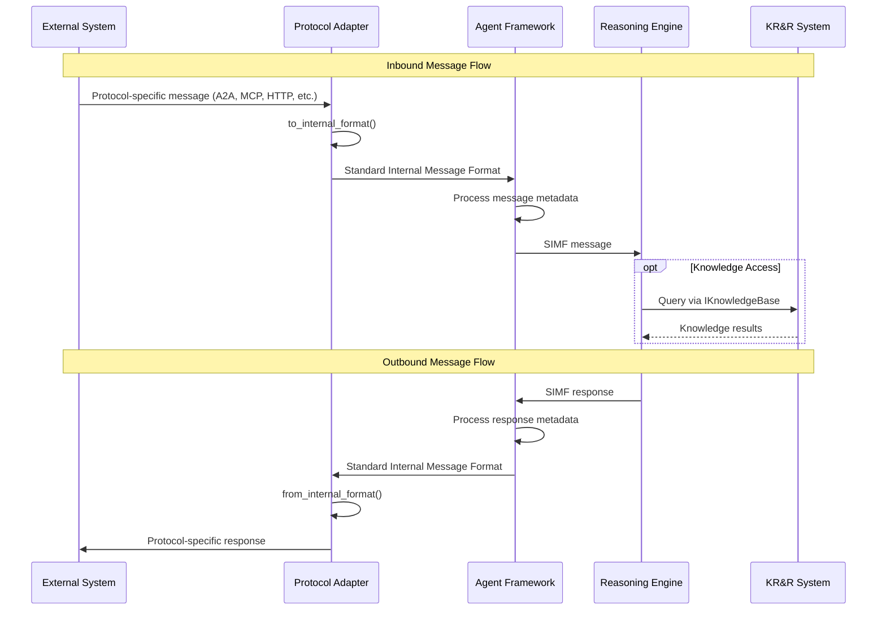

# Standard Internal Message Format

## 1. Introduction and Purpose

The Standard Internal Message Format defines the single, standardized internal message representation used within the OpenMAS Agent Framework. This format serves as the critical intermediary between:

- **Protocol-specific messages** received from external sources (after processing by protocol adapters)
- **Inputs to various reasoning components** that implement agent decision-making logic

It is also the format that reasoning components produce as output, which is then translated by protocol adapters into protocol-specific messages for sending.

### 1.1. Core Functions

The Standard Internal Message Format fulfills several key functions:

- **Enables Protocol Agnosticism**: By providing a common representation that all protocol adapters convert to and from, agents can communicate across multiple protocols without needing protocol-specific logic in their core processing.

- **Supports Reasoning Agnosticism**: By offering a consistent structure that can be consumed by different reasoning engines (or adapted to their specific needs), it maintains the separation between agent communication infrastructure (the "body") and decision-making logic (the "brain").

- **Facilitates Inter-Protocol Bridging**: Serves as the "lingua franca" that enables communication between agents using different protocols, providing a common format for message translation.

- **Standardizes Internal Processing**: Ensures consistent handling of messages throughout the agent's lifecycle, regardless of source protocol or target reasoning approach.

### 1.2. Relationship to OpenMAS Architecture

This format is a cornerstone of OpenMAS's distinctive architecture:

- **Multi-Protocol Support**: As detailed in [multi_protocol_design.md](./multi_protocol_design.md), this format ensures that agents can directly support multiple communication protocols without protocol bridging.

- **Reasoning Agnosticism**: As explained in [reasoning_agnostic_design.md](./reasoning_agnostic_design.md), this format enables the clean separation between communication mechanisms and reasoning approaches.

### 1.3. SIMF Message Flow

The following diagram illustrates the complete lifecycle of a message through the OpenMAS system, highlighting the central role of the Standard Internal Message Format:



This diagram demonstrates how:

1. **Protocol Adapters** perform the critical translation between protocol-specific formats and the Standard Internal Message Format
2. **SIMF** serves as the consistent format for all internal message processing
3. **Reasoning Engines** receive and produce messages in the standard format
4. **KR&R System** provides knowledge access to reasoning engines via `IKnowledgeBase` interfaces
5. **Protocol Independence** is maintained as reasoning engines never interact directly with protocol-specific formats

## 2. Core Structure

Every internal message in OpenMAS conforms to the following structure:

```yaml
# Standard Internal Message Format - Core Structure
message_id:              # string, required, e.g., UUID
  type: string
  required: true
  description: Unique identifier for this message, typically a UUID

session_id:              # string, optional
  type: string
  required: false
  description: Identifier for the conversation/session this message belongs to

timestamp:               # string, ISO 8601, required
  type: string
  format: ISO-8601
  required: true
  description: Time when this message was created or processed

source_protocol_type:    # string, optional, e.g., 'a2a-http', 'mcp-sse'
  type: string
  required: false
  description: Protocol type that the message originated from

source_agent_id:         # string, optional
  type: string
  required: false
  description: Identifier of the agent that sent this message

target_agent_id:         # string, required
  type: string
  required: true
  description: Identifier of the agent that should receive this message

message_flow_direction:  # string, enum, required
  type: string
  enum: ["inbound", "outbound", "internal"]
  required: true
  description: Direction of message flow relative to the agent

message_type:            # string, required
  type: string
  enum: [
    "USER_QUERY",           # Query/request from a user
    "AGENT_RESPONSE",       # Response from an agent to a user or another agent
    "CAPABILITY_INVOCATION", # Invocation of an agent capability
    "CAPABILITY_RESULT",    # Result of a capability invocation
    "TOOL_INVOCATION",      # Invocation of a tool
    "TOOL_RESULT",          # Result of a tool invocation
    "EVENT_NOTIFICATION",   # Notification about an event
    "SYSTEM_COMMAND",       # Command to the system
    "ACKNOWLEDGEMENT",      # Acknowledgement of receipt
    "ERROR_MESSAGE",        # Error notification
    "PLAIN_TEXT_MESSAGE",   # Simple text message
    "MULTI_PART_MESSAGE"    # Message with multiple parts
    # Note: This enum is extensible. New message types can be added by extensions.
  ]
  required: true
  description: Type of the message for routing and processing

payload:                 # object, required
  type: object
  required: true
  description: Content of the message, structure defined in Payload Definition section

metadata:                # object, optional
  type: object
  required: false
  description: Additional contextual information, flexible key-value data
```

## 3. Payload Definition

The `payload` field contains the actual content of the message. Its structure depends on the `payload_type` field, which acts as a discriminator:

```yaml
# Standard Internal Message Format - Payload Definition
payload:
  type: object
  required: true
  properties:
    payload_type:  # string, required, discriminator
      type: string
      required: true
      description: Discriminator for the payload structure
      # Note: This enum is extensible. New payload types can be added by extensions.
```

### 3.1. Text Content Payload

For simple text messages:

```yaml
payload:
  payload_type: "text_content"
  text: string  # The actual text content
```

### 3.2. Structured Data Content Payload

For structured data (JSON objects, etc.):

```yaml
payload:
  payload_type: "structured_data_content"
  data: object  # Any structured data object
```

### 3.3. Asset Reference Content Payload

For references to binary assets (images, files, etc.):

```yaml
payload:
  payload_type: "asset_reference_content"
  asset_id: string       # Unique identifier for the asset
  asset_type: string     # Type of the asset (see asset types below)
  mime_type: string      # Optional MIME type of the asset
```

Asset types can include but are not limited to:
- `image`: Visual assets (PNG, JPEG, GIF, etc.)
- `audio`: Sound files (MP3, WAV, etc.)
- `video`: Video files (MP4, WebM, etc.)
- `document`: Document files (PDF, DOCX, etc.)
- `data`: Data files (CSV, JSON, etc.)
- `model`: Machine learning models
- `embedding`: Vector embeddings
- `prompt_template`: Templates for prompts
- `binary`: Generic binary data

The asset reference content can include additional metadata to support protocol-specific resource handling:

```yaml
payload:
  payload_type: "asset_reference_content"
  asset_id: string       # Unique identifier for the asset
  asset_type: string     # Type of the asset (see asset types above)
  mime_type: string      # Optional MIME type of the asset
  resource_metadata:     # Optional protocol-specific resource metadata
    url: string          # Optional URL for direct access if applicable
    access_method: string # "direct", "streaming", "chunked", etc.
    permissions: object  # Optional access control information
    protocol_specific:   # Protocol-specific attributes
      object            # E.g., HTTP headers, MCP resource attributes, etc.
```

Refer to [Asset Types](/10_asset_management/types/README.md) for a complete list of supported asset types.

For details on how assets are mapped to resources in different protocols, see [Asset Resource Mapping](/05_extensions/asset_resource_mapping.md).

### 3.4. Multi-Part Content Payload

For messages with multiple content parts (e.g., text + images):

```yaml
payload:
  payload_type: "multi_part_content"
  parts: array  # Array of other payload objects (each with its own 'payload_type')
    - part1:    # Each part must include its own payload_type
        payload_type: "text_content"
        text: "Example text content"
    - part2:
        payload_type: "asset_reference_content"
        asset_id: "asset123"
        asset_type: "image"
    - ...
```

This structure directly relates to A2A protocol parts, where each part can have a different type.

### 3.5. Invocation Content Payload

For capability or tool invocations:

```yaml
payload:
  payload_type: "invocation_content"
  invocation_name: string  # Name of the capability or tool being invoked
  arguments: object        # Arguments for the invocation
```

### 3.6. Invocation Result Content Payload

For results of capability or tool invocations:

```yaml
payload:
  payload_type: "invocation_result_content"
  invocation_name: string       # Name of the capability or tool that was invoked
  status: string                # "success", "failure", or "pending"
  result: object                # Optional, result data for successful invocations
  error: object                 # Optional, error information for failed invocations
    code: string                # Error code
    message: string             # Error message
    details: object             # Additional error details
```

### 3.7. Stream Context Content Payload

For messages that are part of a streaming sequence, providing context about the stream state:

```yaml
payload:
  payload_type: "stream_context_content"
  stream_id: string              # Identifier for the stream this message belongs to
  sequence_number: integer       # Position in the stream sequence
  stream_position: string        # "start", "middle", "end", or "complete" (single message stream)
  is_heartbeat: boolean          # Whether this is a keepalive message with no content
  content: object                # The actual content payload (can be any other payload type)
  estimated_remaining: integer   # Optional, estimated number of remaining messages
```

This payload type is particularly useful for translating streaming protocols like gRPC streams, SSE, and MQTT streams into the SIMF format, and ensuring streaming semantics are preserved across protocol boundaries.

### 3.8. Knowledge Representation Content Payload

For formal knowledge structures used in symbolic reasoning or knowledge representation:

```yaml
payload:
  payload_type: "knowledge_representation_content"
  formalism: string              # Knowledge representation formalism
                                 # e.g., "predicate_logic", "description_logic", "rdf", "owl", "prolog"
  representation: string/object  # The actual knowledge content in the specified formalism
  context_id: string             # Optional, identifier for the knowledge context/KB
  operation: string              # Optional, "assert", "query", "retract", "update"
  metadata: object               # Optional, additional information about the knowledge
```

This payload type enables semantic preservation of knowledge structures when translating between protocols and reasoning engines, particularly important for symbolic and hybrid reasoning approaches.

### 3.9. Event Content Payload

For standardized event notifications:

```yaml
payload:
  payload_type: "event_content"
  event_type: string             # Type of event (domain-specific)
  event_source: string           # Source of the event
  timestamp: string              # When the event occurred (ISO 8601)
  data: object                   # Event data payload
  severity: string               # Optional, "debug", "info", "warning", "error", "critical"
  is_transient: boolean          # Whether the event represents a point-in-time occurrence
                                 # or a persistent state change
```

This payload type standardizes event handling across protocols with different event semantics, such as MQTT retained messages, A2A notifications, and HTTP webhooks.

## 4. Protocol Mapping Guidelines

The following guidelines describe how specific protocol features map to SIMF payload types:

### 4.1. A2A Protocol Mapping

| A2A Concept | SIMF Mapping |
|------------|-------------|
| Multi-part messages | `multi_part_content` with appropriate part types |
| Capability invocation | `invocation_content` with capability name and parameters |
| Task artifacts | `invocation_result_content` or specific payload types for content |
| Agent cards | Not a message payload, handled at configuration level |
| Streaming | `stream_context_content` wrapping other content types |

### 4.2. MCP Protocol Mapping

| MCP Concept | SIMF Mapping |
|------------|-------------|
| Tool calls | `invocation_content` with tool name and parameters |
| Tool results | `invocation_result_content` with result data |
| Resources | `asset_reference_content` with appropriate metadata |
| Streaming | `stream_context_content` for chunked responses |

### 4.3. HTTP Protocol Mapping

| HTTP Concept | SIMF Mapping |
|------------|-------------|
| Path parameters | Included in `structured_data_content` or as part of capability routing |
| Query parameters | Included in `structured_data_content` |
| Headers | Mapped to message `metadata` or included in content-specific protocol_metadata |
| Status codes | Mapped to appropriate message_type and status fields |
| Content types | Determine payload_type selection |

### 4.4. MQTT Protocol Mapping

| MQTT Concept | SIMF Mapping |
|------------|-------------|
| Topics | Mapped to capability routing or included in metadata |
| QoS levels | Included in metadata |
| Retained messages | Can use `event_content` with is_transient=false |
| LWT messages | Special case of `event_content` |

### 4.5. gRPC Protocol Mapping

| gRPC Concept | SIMF Mapping |
|------------|-------------|
| Unary RPC | `invocation_content`/`invocation_result_content` pair |
| Server streaming | `stream_context_content` wrapping result content |
| Client streaming | Multiple `invocation_content` messages with same context |
| Bidirectional streaming | Combination of above patterns with stream context |
| Metadata | Mapped to message metadata |

## 5. Extensibility

The Standard Internal Message Format is designed to be extensible while maintaining a core set of defined types for interoperability:

### 5.1. Extending Message Types

The `message_type` enum can be extended by new modules or OpenMAS extensions. When adding new message types:

- New types should follow the existing naming convention (UPPERCASE_WITH_UNDERSCORES)
- Types should be descriptive of the message's purpose
- Extensions should document their custom message types

### 5.2. Extending Payload Types

The `payload_type` discriminator can also be extended:

- New payload types should follow the existing naming convention (snake_case with `_content` suffix)
- Each new payload type must define its specific structure
- Extensions should document their custom payload types

While extensibility is supported, all OpenMAS components should recognize and properly handle the core types defined in this document to ensure interoperability.

## 6. Adaptability for Reasoning Engines

The Standard Internal Message Format is designed to be consumed by various reasoning components within the OpenMAS framework.

### 6.1. Direct Consumption

Some reasoning engines may be able to directly consume the Standard Internal Message Format. For example:

- Rule-based reasoning engines might directly process the structured format
- Custom reasoning components built specifically for OpenMAS

### 6.2. Adaptation Layer

For reasoning engines with specific input requirements, an adaptation layer (within the Agent Framework or as a reasoning-specific adapter) may transform the Standard Internal Message Format into the precise format expected:

- For LLM-based reasoning, the format might be converted to a prompt string with specific structure
- For BDI reasoning, the format might be converted to beliefs, goals, or events (can leverage `knowledge_representation_content`)
- For KR&R approaches, the format might be converted to appropriate knowledge representations (can leverage `knowledge_representation_content`)

### 6.3. Reasoning Engine Mapping

The following table outlines how different reasoning approaches can leverage specific SIMF payload types:

| Reasoning Approach | Primary SIMF Payload Types |
|-------------------|----------------------------|
| LLM-based | `text_content`, `structured_data_content`, `multi_part_content` |
| Rule-based | `structured_data_content`, `knowledge_representation_content` |
| BDI | `knowledge_representation_content`, `event_content`, `structured_data_content` |
| Symbolic KR&R | `knowledge_representation_content`, `structured_data_content` |
| Hybrid | Combination based on constituent approaches |

This adaptation occurs after protocol-to-internal conversion but before reasoning processing, maintaining clean separation between protocols and reasoning approaches.

## 7. Protocol Adapter Responsibilities

Protocol interfaces are responsible for bi-directional translation between their native protocol format and the Standard Internal Message Format.

### 6.1. To Internal Format (`to_internal_format()`)

Protocol adapters must implement a `to_internal_format()` method that converts protocol-specific messages to the Standard Internal Message Format. This method must:

- Extract all relevant information from the protocol-specific message
- Map protocol-specific concepts to the standard internal structure
- Include the original protocol type in `source_protocol_type`
- Generate appropriate payload structures based on content

### 6.2. From Internal Format (`from_internal_format()`)

Protocol adapters must implement a `from_internal_format()` method that converts from the Standard Internal Message Format to their protocol-specific format. This method must:

- Translate the internal structure to the appropriate protocol-specific structure
- Handle all relevant payload types
- Manage protocol-specific requirements like format restrictions

### 6.3. Conceptual Examples

#### Example 1: A2A Multi-Part Message to Internal Format

**Note: The following is a conceptual example only, not actual implementation code. It illustrates the principles of protocol adaptation.**

```python
# CONCEPTUAL EXAMPLE ONLY - NOT ACTUAL IMPLEMENTATION CODE
def a2a_to_internal_format(a2a_message):
    """Convert A2A message to Standard Internal Message Format."""
    internal_message = {
        "message_id": a2a_message.get("id", generate_uuid()),
        "session_id": a2a_message.get("conversation_id"),
        "timestamp": a2a_message.get("timestamp", generate_iso_timestamp()),
        "source_protocol_type": "a2a-http",  # or other A2A variant
        "source_agent_id": a2a_message.get("sender"),
        "target_agent_id": a2a_message.get("recipient"),
        "message_flow_direction": "inbound",
        "message_type": "MULTI_PART_MESSAGE" if len(a2a_message.get("parts", [])) > 1 else "PLAIN_TEXT_MESSAGE",
        "metadata": a2a_message.get("metadata", {})
    }
    
    # Handle parts
    parts = a2a_message.get("parts", [])
    if len(parts) == 1:
        # Single part - direct mapping
        part = parts[0]
        content_type = part.get("content_type")
        
        if content_type == "text/plain":
            internal_message["payload"] = {
                "payload_type": "text_content",
                "text": part.get("content", "")
            }
        elif content_type.startswith("application/json"):
            internal_message["payload"] = {
                "payload_type": "structured_data_content",
                "data": json.loads(part.get("content", "{}"))
            }
        elif content_type.startswith("image/") or content_type.startswith("audio/") or content_type.startswith("video/"):
            # File/asset reference
            internal_message["payload"] = {
                "payload_type": "asset_reference_content",
                "asset_id": part.get("file_id", ""),
                "asset_type": content_type.split("/")[0],  # image, audio, video
                "mime_type": content_type
            }
    else:
        # Multiple parts - create multi-part payload
        internal_parts = []
        for part in parts:
            content_type = part.get("content_type")
            
            if content_type == "text/plain":
                internal_parts.append({
                    "payload_type": "text_content",
                    "text": part.get("content", "")
                })
            elif content_type.startswith("application/json"):
                internal_parts.append({
                    "payload_type": "structured_data_content",
                    "data": json.loads(part.get("content", "{}"))
                })
            elif content_type.startswith("image/") or content_type.startswith("audio/") or content_type.startswith("video/"):
                internal_parts.append({
                    "payload_type": "asset_reference_content",
                    "asset_id": part.get("file_id", ""),
                    "asset_type": content_type.split("/")[0],
                    "mime_type": content_type
                })
            # ... [similar mappings for other content types]
        
        internal_message["payload"] = {
            "payload_type": "multi_part_content",
            "parts": internal_parts
        }
    
    return internal_message
```

#### Example 2: MCP Tool Call Message to Internal Format

**Note: The following is a conceptual example only, not actual implementation code. It illustrates the principles of protocol adaptation.**

```python
# CONCEPTUAL EXAMPLE ONLY - NOT ACTUAL IMPLEMENTATION CODE
def mcp_to_internal_format(mcp_message):
    """Convert MCP message to Standard Internal Message Format."""
    internal_message = {
        "message_id": generate_uuid(),  # MCP may not have message IDs
        "session_id": mcp_message.get("conversation_id"),
        "timestamp": generate_iso_timestamp(),
        "source_protocol_type": "mcp-sse",  # or other MCP variant
        "source_agent_id": "user",  # typically from user in MCP
        "target_agent_id": "agent",  # target is the agent itself
        "message_flow_direction": "inbound",
        "metadata": {}
    }
    
    # Determine message type and payload
    if "tool_calls" in mcp_message:
        # Tool call
        internal_message["message_type"] = "TOOL_INVOCATION"
        tool_call = mcp_message["tool_calls"][0]  # Assuming single tool call
        
        internal_message["payload"] = {
            "payload_type": "invocation_content",
            "invocation_name": tool_call.get("name", ""),
            "arguments": tool_call.get("arguments", {})
        }
    elif "content" in mcp_message:
        # Regular content
        internal_message["message_type"] = "USER_QUERY"
        internal_message["payload"] = {
            "payload_type": "text_content",
            "text": mcp_message.get("content", "")
        }
    
    # Handle resources
    if "resources" in mcp_message:
        # If we have resources but already set a text payload, convert to multi-part
        if internal_message["payload"]["payload_type"] == "text_content":
            text_content = internal_message["payload"]["text"]
            parts = [{
                "payload_type": "text_content",
                "text": text_content
            }]
            
            # Add resources as parts
            for resource in mcp_message["resources"]:
                resource_part = {
                    "payload_type": "asset_reference_content",
                    "asset_id": resource.get("uri", ""),
                    "asset_type": resource.get("type", "binary"),
                    "mime_type": resource.get("mime_type", "application/octet-stream")
                }
                parts.append(resource_part)
            
            internal_message["payload"] = {
                "payload_type": "multi_part_content",
                "parts": parts
            }
            internal_message["message_type"] = "MULTI_PART_MESSAGE"
    
    return internal_message
```

## 8. Impact on Inter-Protocol Bridging

The Standard Internal Message Format serves as the common intermediary ("lingua franca") for any communication between agents using different protocols.

### 7.1. Inter-Protocol Message Flow

When an agent using one protocol communicates with an agent using another protocol, the message flows through the following path:

1. **Source Protocol** → The message originates in a protocol-specific format
2. **Source Protocol Adapter** → Converts to the Standard Internal Message Format
3. **Agent Framework** → Routes the message internally
4. **Target Protocol Adapter** → Converts from Standard Internal Message Format to target protocol format
5. **Target Protocol** → The message is transmitted in the target protocol-specific format

This approach allows seamless communication between different protocols without direct protocol-to-protocol translation logic.

### 7.2. Protocol Adapter vs. Protocol Mapping

It's important to distinguish two related but distinct concepts:

- **Protocol Adapters** (e.g., `MCPInterface`, `A2AInterface`): Handle runtime message content translation to/from the Standard Internal Message Format
- **Protocol Capability Mapping** (e.g., `MCPToA2AAdapter`): Handle design-time capability definition mapping (as seen in `multi_protocol_capabilities.protocol_mapping`)

The former deals with message format conversion during operation, while the latter deals with how agent capabilities are defined and exposed across different protocols.

The Standard Internal Message Format is central to the runtime message conversion process, ensuring that protocol-specific details are abstracted away from the agent's core processing and reasoning components.
