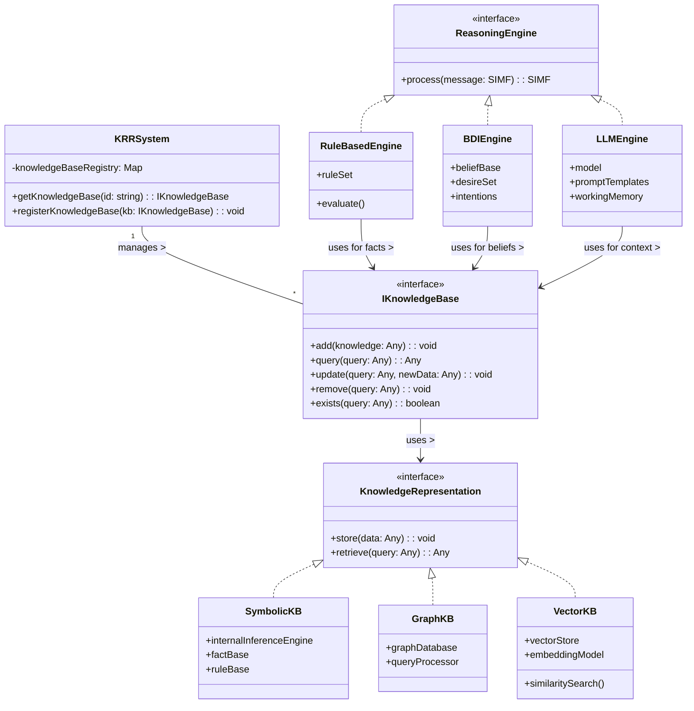

# Reasoning-Agnostic Architecture

## Overview

OpenMAS's distinctive "reasoning-agnostic" architecture is a core design principle that separates agent communication infrastructure (the "body") from various reasoning approaches (the "brain"). This separation allows OpenMAS to support multiple reasoning paradigms while maintaining a consistent communication layer, making it uniquely flexible among agent frameworks.

This reasoning agnosticism is a significant differentiator from other agent frameworks, allowing OpenMAS to bridge classical AI approaches and modern neural approaches while providing flexibility to choose the right reasoning approach for each task.

## Core Principles

1. **Separation of Concerns**: Communication mechanisms (protocols, message handling) are completely decoupled from reasoning mechanisms
2. **Pluggable Reasoning**: Reasoning components can be swapped without affecting communication interfaces
3. **Protocol Independence**: Protocols operate independently of the reasoning approach used
4. **Common Interfaces**: Standard interfaces between communication and reasoning layers
5. **Flexible Configuration**: [Unified configuration schema](/03_configuration/unified_configuration_schema.md) with separate sections for [communication](/03_configuration/schema/protocols.md) and [reasoning](/03_configuration/schema/agents.md#reasoning)

## Reasoning Approaches Supported

OpenMAS supports a diverse range of reasoning approaches:

### 1. Rule-Based Reasoning
- Simple if-then-else logic
- Pattern matching
- Decision trees
- Explicit rule sets with forward/backward chaining

### 2. BDI (Belief-Desire-Intention)
- Belief management
- Goal-directed reasoning
- Intention scheduling
- Plan libraries
- Commitment strategies

### 3. Knowledge Representation and Reasoning (KR&R) System
- **Knowledge Management**
  - Multiple knowledge representation formalisms
    - Symbolic (logic-based)
    - Graph-based
    - Probabilistic models
    - Vector/embedding representations
  - Knowledge management capabilities
    - Storage and retrieval
    - Belief revision
    - Truth maintenance
    - Consistency checking

> **Important**: The KR&R System itself is *not* a reasoning engine - it is a knowledge management layer that provides standardized access to knowledge through interfaces like `IKnowledgeBase`. These interfaces are documented in `/09_knowledge_representation/knowledge_access_interfaces/`. The actual reasoning logic is implemented by `ReasoningEngines` that utilize the knowledge managed by the KR&R System.

### 4. LLM-Based Reasoning
- Prompt engineering
- Chain-of-thought reasoning
- Few-shot learning
- Tool use
- Working memory management
- Self-reflection

### 5. Hybrid Reasoning
- Combined approaches
- Reasoning selection frameworks
- Fallback mechanisms
- Meta-reasoning

## Reasoning Engine and KR&R System Interaction

The following diagram illustrates the relationship between various Reasoning Engines (the "brain") and the KR&R System (the knowledge management layer), highlighting the critical role of the `IKnowledgeBase` interface as the standardized abstraction layer between them:



This diagram demonstrates the key aspects of the reasoning-agnostic design:

1. **Clear Separation**: The KR&R System and Reasoning Engines are distinct components with well-defined responsibilities
2. **Standardized Interface**: All reasoning engines interact with knowledge through the same `IKnowledgeBase` interface
3. **Diverse Knowledge Representations**: The KR&R System manages multiple knowledge representation formats (symbolic, graph, vector)
4. **Reasoning Engine Independence**: Each reasoning engine can leverage the same knowledge bases through a consistent interface
5. **Implementation Abstraction**: Reasoning engines don't need to know the implementation details of knowledge representations

This architecture ensures that:
- Knowledge management is separated from reasoning logic
- Different reasoning approaches can be swapped without changing how knowledge is managed
- Knowledge can be represented in the most appropriate format while still being accessible to any reasoning engine

## Architecture Implementation

### Agent Base Class

The Agent base class provides the framework for connecting reasoning with communication:

```python
class Agent:
    def __init__(self, config):
        self.config = config
        self.protocol_interfaces = []
        self.reasoning_component = None
        
        # Initialize protocol interfaces
        self._initialize_protocols()
        
        # Initialize reasoning component
        self._initialize_reasoning()
    
    def _initialize_protocols(self):
        """Initialize protocol interfaces based on configuration."""
        for protocol_config in self.config.get("protocols", []):
            if not protocol_config.get("enabled", True):
                continue
            
            protocol_type = protocol_config["type"]
            # Factory pattern to create appropriate protocol interface
            self.protocol_interfaces.append(
                create_protocol_interface(protocol_type, self, protocol_config)
            )
    
    def _initialize_reasoning(self):
        """Initialize reasoning component based on configuration."""
        reasoning_config = self.config.get("reasoning", {})
        reasoning_type = reasoning_config.get("type", "rule_based")
        
        # Factory pattern to create appropriate reasoning component
        self.reasoning_component = create_reasoning_component(
            reasoning_type, reasoning_config
        )
    
    async def handle_message(self, message, protocol_interface):
        """Handle incoming message by passing to reasoning component."""
        # Preprocessing by protocol interface
        processed_message = protocol_interface.preprocess_message(message)
        
        # Pass to reasoning component for processing
        reasoning_result = await self.reasoning_component.process(processed_message)
        
        # Postprocessing by protocol interface
        response = protocol_interface.create_response(reasoning_result)
        
        return response
```

### Protocol Interface

Protocol interfaces handle protocol-specific communication but remain agnostic to reasoning:

```python
class ProtocolInterface:
    def __init__(self, agent, config):
        self.agent = agent
        self.config = config
    
    async def send_message(self, recipient, content):
        """Send message using this protocol."""
        pass
    
    async def receive_message(self, message):
        """Receive message using this protocol and pass to agent."""
        response = await self.agent.handle_message(message, self)
        return response
    
    def preprocess_message(self, message):
        """Convert protocol-specific message to reasoning-agnostic format."""
        pass
    
    def create_response(self, reasoning_result):
        """Convert reasoning result to protocol-specific response."""
        pass
```

### Reasoning Component

Reasoning components implement specific reasoning approaches but remain agnostic to protocols:

```python
class ReasoningComponent:
    def __init__(self, config):
        self.config = config
    
    async def process(self, message):
        """Process a message using this reasoning approach."""
        pass
```

## Key Interfaces Between Layers

1. **Message Standardization**: Protocol interfaces convert protocol-specific messages to the Standard Internal Message Format as defined in [internal_message_format_standard.md](./internal_message_format_standard.md)
2. **Context Management**: Communication layer provides context to reasoning layer
3. **Response Generation**: Reasoning results are converted back to protocol-specific formats
4. **Capability Exposure**: Protocol interfaces expose agent capabilities based on reasoning capabilities

## Benefits of Reasoning Agnosticism

1. **Flexibility**: Adapt to different use cases with appropriate reasoning approaches
2. **Evolution**: Evolve reasoning approaches without breaking communication
3. **Interoperability**: Agents with different reasoning can still communicate
4. **Specialization**: Use specialized reasoning for specific tasks
5. **Experimentation**: Easily test new reasoning approaches

## Comparison with Other Frameworks

OpenMAS's reasoning agnosticism differentiates it from:

- **LangChain/LlamaIndex**: Primarily focused on LLM-based reasoning
- **AutoGPT/BabyAGI**: Built around specific LLM reasoning patterns
- **JADE/SPADE**: Primarily focused on BDI reasoning
- **GAMA**: Focused on simulation-based reasoning

By bridging classical AI and modern neural approaches while maintaining clean separation, OpenMAS provides unique flexibility in choosing the right reasoning approach for each task.

## Example: Multi-Protocol Agent with Different Reasoning

```yaml
# Example configuration demonstrating reasoning agnosticism
name: "hybrid-agent"
version: "0.3.0"

agents:
  main_agent:
    protocols:
      - type: "a2a-http"
        enabled: true
        options:
          base_url: "http://localhost:8080"
          agent_card:
            name: "Hybrid Agent"
            description: "Agent supporting multiple protocols and reasoning approaches"
      
      - type: "mcp-sse"
        enabled: true
        options:
          server_mode: true
          http_port: 8081
    
    reasoning:
      type: "hybrid"
      components:
        - type: "rule_based"
          rules_file: "config/rules.json"
          priority: 1
        
        - type: "llm_based"
          service_url: "http://llm-service:8080/generate"
          model: "gpt-4o"
          priority: 2
      
      fallback: "llm_based"
```

This architecture ensures that OpenMAS can adapt to the rapidly evolving landscape of AI reasoning approaches while maintaining stable communication interfaces, providing a future-proof foundation for multi-agent systems.
