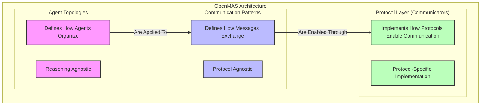

# Integration of Agent Topologies, Communication Patterns, and Communicators

This document defines the relationships and integration points between three key architectural components in OpenMAS v0.3.0:

1. **Agent Topologies**: How agents are organized and their relationships
2. **Communication Patterns**: How agents exchange messages
3. **Communicators**: The protocol implementations that enable communication

## Architectural Relationships

The diagram below illustrates the hierarchical relationships between the three key architectural components and how they integrate within OpenMAS:



This diagram demonstrates the layered architecture of OpenMAS:

1. **Top Level - Agent Topologies**: Define the organizational structure and relationships between agents, independent of how they communicate

2. **Middle Level - Communication Patterns**: Define the interaction patterns for message exchange between agents, independent of specific protocol implementations

3. **Bottom Level - Protocol Layer**: Implements the specific protocols (A2A, MCP, HTTP, etc.) that enable the communication patterns

## Integration Model

### Hierarchical Relationship

The relationship between these components follows a hierarchical structure:

1. **Agent Topologies** (highest level)
   - Define organizational structure and relationships
   - Determine which agents communicate with which other agents
   - Independent of how communication occurs

2. **Communication Patterns** (middle level)
   - Define how messages are exchanged between related agents
   - Specify message flow, timing, and interaction models
   - Independent of protocol details

3. **Communicators** (lowest level)
   - Implement specific protocols (A2A, MCP, HTTP, MQTT, gRPC)
   - Handle protocol-specific message formatting and transport
   - Adapt protocol capabilities to support the required patterns

### Key Integration Points

1. **Topology → Pattern Mapping**
   - Each relationship in a topology specifies which communication pattern(s) to use
   - Example: Orchestrator-to-Worker relationship uses Request-Response pattern

2. **Pattern → Protocol Adaptation**
   - Each pattern defines how it adapts to different protocols
   - Example: Request-Response pattern using A2A tasks API vs. HTTP REST calls

3. **Combined Configuration Model**
   - The OpenMAS configuration system integrates all three components
   - Configuration is layered: topology → pattern → protocol specifics

## Configuration Integration Example

```yaml
# OpenMAS Project Configuration showing integration
name: travel_planning_system
version: 0.3.0

# Agent topology definition
topology:
  pattern: "centralized"
  roles:
    types:
      - name: "orchestrator"
        description: "Central coordinator"
      - name: "worker"
        description: "Specialized service provider"
  relationships:
    types:
      - name: "orchestrator_to_worker"
        communication_pattern: "request_response"
      - name: "worker_to_orchestrator"
        communication_pattern: "event_based"

# Communication patterns configuration
communication_patterns:
  request_response:
    options:
      timeout: 30000
      retry:
        attempts: 3
    protocol_adaptations:
      a2a:
        use_streaming: false
      http:
        method: "POST"
  
  event_based:
    options:
      event_buffer_size: 100
    protocol_adaptations:
      mqtt:
        qos_level: 1
        retain: false

# Agent configurations
agents:
  travel_coordinator:
    class: "agents.coordinator.TravelCoordinator"
    communicator_type: "a2a"
    communicator_options:
      server_mode: true
      http_port: 8000
    # Topology configuration for this agent
    topology:
      role: "orchestrator"
      relationships:
        - agent_id: "flight_search"
          relationship_type: "orchestrator_to_worker"
        - agent_id: "hotel_search"
          relationship_type: "orchestrator_to_worker"
  
  flight_search:
    class: "agents.flight.FlightSearchAgent"
    communicator_type: "a2a"
    communicator_options:
      server_mode: true
      http_port: 8001
    # Topology configuration for this agent
    topology:
      role: "worker"
      relationships:
        - agent_id: "travel_coordinator"
          relationship_type: "worker_to_orchestrator"
          communication_pattern: "event_based"
  
  hotel_search:
    class: "agents.hotel.HotelSearchAgent"
    communicator_type: "mcp"  # Different protocol!
    communicator_options:
      server_mode: true
      server_instructions: "Hotel search service using MCP protocol"
    # Topology configuration for this agent
    topology:
      role: "worker"
      relationships:
        - agent_id: "travel_coordinator"
          relationship_type: "worker_to_orchestrator"
          # Pattern still works despite different protocol
          communication_pattern: "event_based"
```

## Integration with Reasoning Approaches

The integration model preserves OpenMAS's reasoning agnosticism by separating:

1. **Organization Structure** (Topologies)
2. **Communication Methods** (Patterns)
3. **Protocol Implementation** (Communicators)

From the agent's **reasoning approach** (body vs. brain separation)

The same topology, pattern, and communicator configuration can work with:
- Rule-based reasoning
- BDI architecture
- LLM-based reasoning
- Knowledge Representation and Reasoning (KR&R) approaches
- Hybrid approaches

## Multi-Protocol Support in Integration

A key benefit of this integrated approach is robust multi-protocol support:

1. **Protocol-Agnostic Topology**: The same agent organization works across protocols
2. **Protocol-Agnostic Patterns**: The same communication patterns work across protocols
3. **Protocol-Specific Adaptation**: Each protocol implements patterns according to its capabilities

Example: A centralized topology with request-response pattern works whether using:
- A2A protocol with task-based messaging
- MCP protocol with tool-based interaction
- HTTP protocol with REST endpoints
- MQTT protocol with topic-based messaging
- gRPC protocol with service definitions

## Runtime Implementation

The integration approach is implemented in the OpenMAS framework through:

1. **TopologyManager**: Loads topology configuration and manages agent relationships
2. **PatternRegistry**: Registers and configures communication patterns
3. **CommunicatorFactory**: Creates and configures protocol-specific communicators

```python
# Example implementation
from openmas.agent import Agent
from openmas.topology import TopologyManager
from openmas.patterns import RequestResponsePattern, EventBasedPattern
from openmas.communicator import A2ACommunicator

class TravelCoordinator(Agent):
    async def setup(self):
        # Set up topology
        self.topology_manager = TopologyManager(self)
        
        # Register capabilities with patterns
        self.register_capability(
            "search_flights",
            self.search_flights,
            pattern=RequestResponsePattern(
                timeout=30000,
                retry={"attempts": 3}
            ),
            protocols=["a2a", "mcp", "http"]  # Multi-protocol support
        )
        
        # Discover related agents based on topology
        self.worker_agents = await self.topology_manager.get_related_agents(
            relationship_type="orchestrator_to_worker"
        )
    
    async def search_flights(self, params):
        # Invoke capability on worker agent using topology and pattern
        result = await self.topology_manager.invoke_agent(
            agent_id="flight_search",
            capability="perform_flight_search",
            params=params
        )
        return result
```

## Benefits of Integrated Approach

1. **Separation of Concerns**:
   - Topology defines WHO communicates
   - Pattern defines HOW they communicate
   - Communicator defines WHICH PROTOCOL they use

2. **Flexibility and Adaptability**:
   - Change topology without changing patterns or protocols
   - Change patterns without changing topology or protocols
   - Change protocols without changing topology or patterns

3. **Consistent Multi-Protocol Support**:
   - Same agent logic works across protocols
   - Protocol-specific details handled by adaptation layer
   - Mix protocols within the same agent system

4. **Developer Experience**:
   - Clear separation of structural concerns
   - Standardized configuration model
   - Reusable patterns and topologies

## Visualization of Integration

```
                      ┌────────────────────┐
                      │  Agent Topology    │
                      │  (Centralized)     │
                      └──────────┬─────────┘
                                 │
                                 ▼
          ┌───────────────────────────────────────────┐
          │Relationship: orchestrator_to_worker       │
          └─────────────────────┬─────────────────────┘
                                │
                                ▼
          ┌───────────────────────────────────────────┐
          │Communication Pattern: request_response     │
          └─────────────────────┬─────────────────────┘
                                │
                    ┌───────────┴───────────┐
                    │                       │
                    ▼                       ▼
    ┌───────────────────────┐  ┌────────────────────────┐
    │Protocol: A2A          │  │Protocol: MCP           │
    │Implementation:        │  │Implementation:          │
    │- Task-based messaging │  │- Tool-based interaction │
    └───────────────────────┘  └────────────────────────┘
```

## Future Directions

The integration of topologies, patterns, and communicators enables several future improvements:

1. **Pattern Composition**: Combining multiple patterns for complex interactions
2. **Topology Transformation**: Runtime adaptation of agent organization
3. **Multi-Protocol Support**: Agents with multiple protocol interfaces communicate directly with other agents regardless of their supported protocols
4. **Dynamic Communication**: Runtime selection of optimal patterns based on context
5. **Formal Verification**: Analyzing topology and pattern configurations for correctness

## Conclusion

The integration of agent topologies, communication patterns, and communicators creates a powerful, flexible framework for building multi-agent systems that are:

1. **Protocol-agnostic**: Working across multiple communication protocols
2. **Reasoning-agnostic**: Supporting various agent reasoning approaches
3. **Declaratively configured**: Using standardized configuration schemas
4. **Consistently implemented**: Following clear design patterns

This integrated approach is a key differentiator for OpenMAS, providing developers with a robust foundation for building complex agent systems that can evolve over time.
