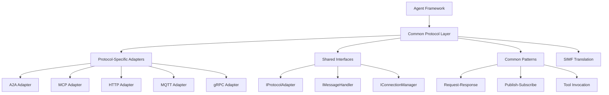

# Common Protocol Patterns and Interfaces

This directory contains protocol-agnostic patterns, shared interfaces, and common implementations that can be reused across all OpenMAS communication protocols (A2A, MCP, HTTP, MQTT, gRPC).

## Overview

The common protocol layer provides:
- **Shared Interfaces**: Common abstractions for all protocols
- **Protocol Patterns**: Reusable communication patterns
- **Base Implementations**: Common functionality across protocols
- **Protocol Translation**: SIMF-based protocol bridging
- **Quality Attributes**: Reliability, security, and performance patterns

## Architecture

### Protocol Independence Layer



### Key Principles

1. **Protocol Agnosticism**: Agents work with any protocol without modification
2. **SIMF Translation**: All protocols translate to/from Standard Internal Message Format
3. **Pattern Reuse**: Common communication patterns across protocols
4. **Graceful Degradation**: Fallback capabilities when features aren't available
5. **Quality Consistency**: Consistent reliability, security, and performance

## Documentation Structure

This directory contains:

| Document | Description |
|----------|-------------|
| [Shared Interfaces](./shared_interfaces.md) | Common interfaces across all protocols |
| [Protocol Patterns](./protocol_patterns.md) | Reusable communication patterns |
| [SIMF Translation](./simf_translation.md) | Protocol-to-SIMF translation patterns |
| [Quality Attributes](./quality_attributes.md) | Reliability, security, performance |
| [Protocol Bridge](./protocol_bridge.md) | Cross-protocol communication |
| [Fallback Strategies](./fallback_strategies.md) | Graceful degradation patterns |

## Shared Interfaces

### Core Protocol Interface

```python
from abc import ABC, abstractmethod
from typing import Dict, List, Optional, Any
from openmas.core.simf import SIMFMessage

class IProtocolAdapter(ABC):
    """Base interface for all protocol adapters"""

    @abstractmethod
    async def initialize(self, config: Dict[str, Any]) -> None:
        """Initialize the protocol adapter"""
        pass

    @abstractmethod
    async def send_message(self, message: SIMFMessage, target: str) -> SIMFMessage:
        """Send a message and return response"""
        pass

    @abstractmethod
    async def receive_message(self) -> SIMFMessage:
        """Receive incoming message"""
        pass

    @abstractmethod
    async def subscribe(self, topic: str, handler: callable) -> None:
        """Subscribe to message topic/pattern"""
        pass

    @abstractmethod
    async def close(self) -> None:
        """Close protocol connections"""
        pass

    @property
    @abstractmethod
    def protocol_name(self) -> str:
        """Return protocol identifier"""
        pass

    @property
    @abstractmethod
    def capabilities(self) -> List[str]:
        """Return protocol capabilities"""
        pass
```

### Message Handler Interface

```python
class IMessageHandler(ABC):
    """Interface for protocol-specific message handling"""

    @abstractmethod
    async def handle_request(self, message: SIMFMessage) -> SIMFMessage:
        """Handle request message"""
        pass

    @abstractmethod
    async def handle_response(self, message: SIMFMessage) -> None:
        """Handle response message"""
        pass

    @abstractmethod
    async def handle_notification(self, message: SIMFMessage) -> None:
        """Handle notification message"""
        pass

    @abstractmethod
    async def handle_error(self, error: Exception, context: Dict[str, Any]) -> SIMFMessage:
        """Handle error and generate error response"""
        pass
```

### Connection Manager Interface

```python
class IConnectionManager(ABC):
    """Interface for managing protocol connections"""

    @abstractmethod
    async def connect(self, endpoint: str, options: Dict[str, Any]) -> str:
        """Establish connection and return connection ID"""
        pass

    @abstractmethod
    async def disconnect(self, connection_id: str) -> None:
        """Close specific connection"""
        pass

    @abstractmethod
    async def is_connected(self, connection_id: str) -> bool:
        """Check connection status"""
        pass

    @abstractmethod
    async def get_connection_info(self, connection_id: str) -> Dict[str, Any]:
        """Get connection metadata"""
        pass

    @abstractmethod
    async def reconnect(self, connection_id: str) -> None:
        """Reconnect a failed connection"""
        pass
```

## Common Protocol Patterns

### 1. Request-Response Pattern

```python
class RequestResponsePattern:
    """Common request-response pattern across protocols"""

    def __init__(self, adapter: IProtocolAdapter):
        self.adapter = adapter
        self.pending_requests = {}

    async def send_request(self, message: SIMFMessage, target: str, timeout: float = 30.0) -> SIMFMessage:
        """Send request and wait for response"""

        # Generate correlation ID
        correlation_id = str(uuid.uuid4())
        message.metadata["correlation_id"] = correlation_id
        message.metadata["pattern"] = "request_response"

        # Store pending request
        future = asyncio.Future()
        self.pending_requests[correlation_id] = future

        try:
            # Send request
            await self.adapter.send_message(message, target)

            # Wait for response with timeout
            response = await asyncio.wait_for(future, timeout=timeout)
            return response

        except asyncio.TimeoutError:
            # Clean up and raise timeout error
            self.pending_requests.pop(correlation_id, None)
            raise TimeoutError(f"Request {correlation_id} timed out after {timeout}s")

        finally:
            # Ensure cleanup
            self.pending_requests.pop(correlation_id, None)

    async def handle_response(self, response: SIMFMessage) -> None:
        """Handle incoming response"""

        correlation_id = response.metadata.get("correlation_id")

        if correlation_id and correlation_id in self.pending_requests:
            future = self.pending_requests.pop(correlation_id)
            if not future.done():
                future.set_result(response)
```

### 2. Publish-Subscribe Pattern

```python
class PublishSubscribePattern:
    """Common pub-sub pattern across protocols"""

    def __init__(self, adapter: IProtocolAdapter):
        self.adapter = adapter
        self.subscriptions = {}

    async def publish(self, topic: str, message: SIMFMessage) -> None:
        """Publish message to topic"""

        message.metadata["pattern"] = "publish_subscribe"
        message.metadata["topic"] = topic

        # Protocol-specific publishing
        await self.adapter.send_message(message, topic)

    async def subscribe(self, topic: str, handler: callable) -> str:
        """Subscribe to topic with handler"""

        subscription_id = str(uuid.uuid4())

        # Wrap handler to process SIMF messages
        async def wrapped_handler(message: SIMFMessage):
            if message.metadata.get("topic") == topic:
                await handler(message)

        # Store subscription
        self.subscriptions[subscription_id] = {
            "topic": topic,
            "handler": wrapped_handler
        }

        # Protocol-specific subscription
        await self.adapter.subscribe(topic, wrapped_handler)

        return subscription_id

    async def unsubscribe(self, subscription_id: str) -> None:
        """Unsubscribe from topic"""

        if subscription_id in self.subscriptions:
            subscription = self.subscriptions.pop(subscription_id)
            # Protocol-specific unsubscription
            await self.adapter.unsubscribe(subscription["topic"])
```

### 3. Tool Invocation Pattern

```python
class ToolInvocationPattern:
    """Common tool invocation pattern across protocols"""

    def __init__(self, adapter: IProtocolAdapter):
        self.adapter = adapter
        self.available_tools = {}

    async def invoke_tool(self, tool_name: str, arguments: Dict[str, Any], target: str = None) -> SIMFMessage:
        """Invoke a tool with arguments"""

        # Create tool invocation message
        tool_message = SIMFMessage(
            content=f"Invoke tool: {tool_name}",
            message_type="tool_invocation",
            metadata={
                "pattern": "tool_invocation",
                "tool_name": tool_name,
                "arguments": arguments
            }
        )

        # Send tool invocation
        if target:
            response = await self.adapter.send_message(tool_message, target)
        else:
            # Find appropriate target for tool
            target = await self.find_tool_provider(tool_name)
            response = await self.adapter.send_message(tool_message, target)

        return response

    async def register_tool(self, tool_name: str, handler: callable, metadata: Dict[str, Any] = None) -> None:
        """Register a tool for invocation"""

        self.available_tools[tool_name] = {
            "handler": handler,
            "metadata": metadata or {}
        }

    async def handle_tool_invocation(self, message: SIMFMessage) -> SIMFMessage:
        """Handle incoming tool invocation"""

        tool_name = message.metadata.get("tool_name")
        arguments = message.metadata.get("arguments", {})

        if tool_name not in self.available_tools:
            return SIMFMessage(
                content=f"Tool {tool_name} not available",
                message_type="error",
                metadata={"error_code": "TOOL_NOT_FOUND"}
            )

        try:
            # Execute tool
            tool_handler = self.available_tools[tool_name]["handler"]
            result = await tool_handler(**arguments)

            # Return successful result
            return SIMFMessage(
                content="Tool execution successful",
                message_type="tool_result",
                metadata={
                    "tool_name": tool_name,
                    "result": result,
                    "success": True
                }
            )

        except Exception as e:
            # Return error result
            return SIMFMessage(
                content=f"Tool execution failed: {str(e)}",
                message_type="error",
                metadata={
                    "tool_name": tool_name,
                    "error": str(e),
                    "success": False
                }
            )
```

## SIMF Translation Layer

### Protocol-to-SIMF Translation

```python
class ProtocolTranslator:
    """Base class for protocol-to-SIMF translation"""

    @abstractmethod
    async def to_simf(self, protocol_message: Any) -> SIMFMessage:
        """Convert protocol-specific message to SIMF"""
        pass

    @abstractmethod
    async def from_simf(self, simf_message: SIMFMessage) -> Any:
        """Convert SIMF message to protocol-specific format"""
        pass

    def preserve_semantics(self, source_message: Any, target_message: Any) -> None:
        """Ensure semantic equivalence between source and target"""
        # Common semantic preservation logic
        pass

class CommonTranslationPatterns:
    """Common translation patterns across protocols"""

    @staticmethod
    def extract_common_metadata(protocol_message: Any) -> Dict[str, Any]:
        """Extract common metadata patterns"""

        metadata = {}

        # Common patterns
        if hasattr(protocol_message, 'id'):
            metadata['message_id'] = protocol_message.id

        if hasattr(protocol_message, 'timestamp'):
            metadata['timestamp'] = protocol_message.timestamp

        if hasattr(protocol_message, 'sender'):
            metadata['sender'] = protocol_message.sender

        if hasattr(protocol_message, 'recipient'):
            metadata['recipient'] = protocol_message.recipient

        return metadata

    @staticmethod
    def apply_common_metadata(simf_message: SIMFMessage, protocol_message: Any) -> None:
        """Apply SIMF metadata to protocol message"""

        # Apply common patterns
        if hasattr(protocol_message, 'id') and 'message_id' in simf_message.metadata:
            protocol_message.id = simf_message.metadata['message_id']

        if hasattr(protocol_message, 'timestamp') and 'timestamp' in simf_message.metadata:
            protocol_message.timestamp = simf_message.metadata['timestamp']

        # Continue for other common fields...
```

## Quality Attributes

### Reliability Patterns

```python
class ReliabilityManager:
    """Common reliability patterns across protocols"""

    def __init__(self, adapter: IProtocolAdapter):
        self.adapter = adapter
        self.retry_config = {
            "max_retries": 3,
            "base_delay": 1.0,
            "max_delay": 30.0,
            "exponential_base": 2.0
        }

    async def reliable_send(self, message: SIMFMessage, target: str) -> SIMFMessage:
        """Send message with retry and error handling"""

        last_exception = None
        delay = self.retry_config["base_delay"]

        for attempt in range(self.retry_config["max_retries"] + 1):
            try:
                return await self.adapter.send_message(message, target)

            except Exception as e:
                last_exception = e

                if attempt < self.retry_config["max_retries"]:
                    # Wait before retry
                    await asyncio.sleep(delay)

                    # Exponential backoff
                    delay = min(
                        delay * self.retry_config["exponential_base"],
                        self.retry_config["max_delay"]
                    )
                else:
                    # Max retries reached, raise last exception
                    raise last_exception

    async def circuit_breaker(self, operation: callable, failure_threshold: int = 5) -> Any:
        """Circuit breaker pattern for protocol operations"""

        # Circuit breaker implementation
        # (This would track failures and open circuit when threshold reached)
        pass
```

### Security Patterns

```python
class SecurityManager:
    """Common security patterns across protocols"""

    def __init__(self):
        self.encryption_config = {}
        self.auth_config = {}

    async def encrypt_message(self, message: SIMFMessage) -> SIMFMessage:
        """Encrypt sensitive message content"""

        if self.should_encrypt(message):
            # Encrypt content
            encrypted_content = await self.encrypt_content(message.content)

            # Create encrypted message
            encrypted_message = SIMFMessage(
                content=encrypted_content,
                message_type=message.message_type,
                metadata={
                    **message.metadata,
                    "encrypted": True,
                    "encryption_algorithm": "AES-256-GCM"
                }
            )

            return encrypted_message

        return message

    async def authenticate_message(self, message: SIMFMessage, sender: str) -> bool:
        """Authenticate message sender"""

        # Authentication logic
        signature = message.metadata.get("signature")
        if signature:
            return await self.verify_signature(message, signature, sender)

        return False

    def should_encrypt(self, message: SIMFMessage) -> bool:
        """Determine if message should be encrypted"""

        sensitive_types = ["auth", "payment", "personal_data"]
        return message.message_type in sensitive_types
```

## Protocol Bridging

### Cross-Protocol Communication

```python
class ProtocolBridge:
    """Enable communication across different protocols"""

    def __init__(self, adapters: Dict[str, IProtocolAdapter]):
        self.adapters = adapters
        self.translation_cache = {}

    async def bridge_message(self, message: SIMFMessage, source_protocol: str, target_protocol: str, target: str) -> SIMFMessage:
        """Bridge message from one protocol to another"""

        if source_protocol == target_protocol:
            # Same protocol, direct send
            return await self.adapters[source_protocol].send_message(message, target)

        # Cross-protocol bridging

        # 1. Ensure message is in SIMF format
        if not isinstance(message, SIMFMessage):
            source_adapter = self.adapters[source_protocol]
            message = await source_adapter.translator.to_simf(message)

        # 2. Add bridging metadata
        message.metadata["bridged"] = True
        message.metadata["source_protocol"] = source_protocol
        message.metadata["target_protocol"] = target_protocol

        # 3. Send via target protocol
        target_adapter = self.adapters[target_protocol]
        response = await target_adapter.send_message(message, target)

        return response

    async def setup_protocol_subscription(self, source_protocol: str, target_protocol: str, topic_mapping: Dict[str, str]) -> None:
        """Set up cross-protocol subscription bridge"""

        source_adapter = self.adapters[source_protocol]
        target_adapter = self.adapters[target_protocol]

        for source_topic, target_topic in topic_mapping.items():
            # Subscribe to source protocol
            async def bridge_handler(message: SIMFMessage):
                # Bridge to target protocol
                await target_adapter.send_message(message, target_topic)

            await source_adapter.subscribe(source_topic, bridge_handler)
```

## Testing Common Patterns

### Protocol Pattern Tests

```python
@pytest.mark.asyncio
async def test_request_response_pattern():
    """Test request-response pattern across protocols"""

    for protocol_name, adapter in test_adapters.items():
        pattern = RequestResponsePattern(adapter)

        # Create test request
        request = SIMFMessage(
            content="Test request",
            message_type="request"
        )

        # Send request and verify response
        response = await pattern.send_request(request, "test_target")

        assert response.message_type == "response"
        assert "correlation_id" in response.metadata

@pytest.mark.asyncio
async def test_protocol_bridging():
    """Test cross-protocol communication"""

    bridge = ProtocolBridge(test_adapters)

    # Create message in A2A format
    a2a_message = SIMFMessage(
        content="Bridge test",
        message_type="request"
    )

    # Bridge from A2A to MCP
    response = await bridge.bridge_message(
        a2a_message,
        "a2a",
        "mcp",
        "mcp_target"
    )

    assert response.metadata.get("bridged") is True
    assert response.metadata.get("source_protocol") == "a2a"
    assert response.metadata.get("target_protocol") == "mcp"
```

## Performance Optimization

### Common Performance Patterns

```python
class PerformanceManager:
    """Common performance optimization patterns"""

    def __init__(self):
        self.message_cache = {}
        self.connection_pool = {}

    async def cached_send(self, message: SIMFMessage, target: str, cache_key: str = None) -> SIMFMessage:
        """Send message with caching"""

        if cache_key and cache_key in self.message_cache:
            cached_response = self.message_cache[cache_key]
            if self.is_cache_valid(cached_response):
                return cached_response["response"]

        # Send message and cache response
        response = await self.send_message(message, target)

        if cache_key:
            self.message_cache[cache_key] = {
                "response": response,
                "timestamp": datetime.utcnow()
            }

        return response

    async def batch_send(self, messages: List[SIMFMessage], targets: List[str]) -> List[SIMFMessage]:
        """Send multiple messages in batch"""

        # Send all messages concurrently
        tasks = [
            self.send_message(msg, target)
            for msg, target in zip(messages, targets)
        ]

        responses = await asyncio.gather(*tasks, return_exceptions=True)
        return responses
```

## References

- [Protocol Specifications](../)
- [SIMF Documentation](../../01_architecture/internal_message_format_standard.md)
- [Agent Framework](../../04_agents/)
- [Session Management](../../04_agents/sessions/)
- [Security Guidelines](../../17_security/)
- [Performance Optimization](../../12_observability/)
