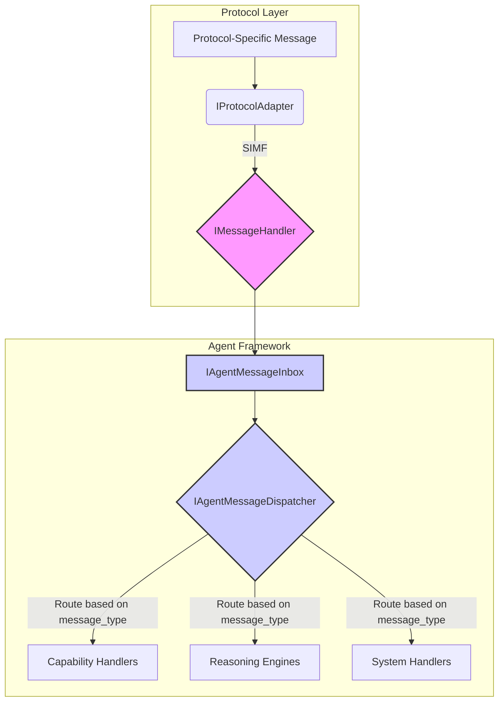

# Agent Framework Message Handling Interfaces

This document defines the core interfaces responsible for receiving and dispatching messages within the OpenMAS Agent Framework. These interfaces connect the protocol layer (specifically, the `IMessageHandler`) to the agent's internal logic.

## Overview

Once a protocol adapter translates a raw message into the Standard Internal Message Format (SIMF), the `IMessageHandler` passes it to the agent's message handling system. This system is composed of two primary components:

1.  **Message Inbox (`IAgentMessageInbox`)**: A queue-like component that receives incoming messages from any protocol and holds them for processing. This decouples the network-facing components from the agent's internal processing loop.
2.  **Message Dispatcher (`IAgentMessageDispatcher`)**: A component that retrieves messages from the inbox and routes them to the correct internal handler (e.g., a capability handler, a reasoning engine, or a system command processor) based on their type and content.

This separation of concerns ensures a robust, scalable, and testable message processing pipeline.



## Interface Definitions

### `IAgentMessageInbox`

The message inbox is the entry point for all messages into the agent. It is responsible for safely queuing messages for later processing.

```python
from abc import ABC, abstractmethod
from typing import AsyncGenerator

# Assumes the enhanced InternalMessageFormat is available
from openmas.schemas.simf import InternalMessageFormat

class IAgentMessageInbox(ABC):
    """Interface for an agent's message inbox.

    This component receives messages from the IMessageHandler and queues them
    for processing by the agent's dispatcher.
    """

    @abstractmethod
    async def post_message(self, message: InternalMessageFormat) -> None:
        """Adds a message to the inbox.

        This method should be thread-safe and non-blocking.

        Args:
            message: The SIMF message to add to the inbox.
        """
        pass

    @abstractmethod
    async def get_message_stream(self) -> AsyncGenerator[InternalMessageFormat, None]:
        """Returns an async generator that yields messages from the inbox.

        This allows the dispatcher to process messages as they arrive.
        The generator should block until a message is available.

        Yields:
            The next message from the inbox.
        """
        # The 'yield' statement is used here to indicate it's a generator.
        # In a real implementation, this would likely involve an asyncio.Queue.
        yield

    @abstractmethod
    async def get_message_count(self) -> int:
        """Returns the current number of messages in the inbox."""
        pass
```

### `IAgentMessageDispatcher`

The dispatcher is the agent's central routing hub. It continuously polls the inbox and dispatches messages to registered handlers.

```python
from abc import ABC, abstractmethod
from typing import Callable, Coroutine, Any

# Assumes the enhanced InternalMessageFormat is available
from openmas.schemas.simf import InternalMessageFormat, MessageType

# Type hint for a handler function
MessageHandlerFunc = Callable[[InternalMessageFormat], Coroutine[Any, Any, None]]

class IAgentMessageDispatcher(ABC):
    """Interface for an agent's message dispatcher.

    This component retrieves messages from the inbox and routes them to
    the appropriate registered handler based on message type.
    """

    @abstractmethod
    async def register_handler(self, message_type: MessageType, handler: MessageHandlerFunc) -> None:
        """Registers a handler for a specific message type.

        Args:
            message_type: The type of message to handle.
            handler: The coroutine function to be called with the message.
        """
        pass

    @abstractmethod
    async def unregister_handler(self, message_type: MessageType) -> None:
        """Unregisters a handler for a message type."""
        pass

    @abstractmethod
    async def dispatch(self, message: InternalMessageFormat) -> None:
        """Dispatches a single message to its registered handler.

        If no handler is registered for the message's type, it may be sent
        to a default handler or logged as an error.

        Args:
            message: The message to dispatch.
        """
        pass

    @abstractmethod
    async def start(self) -> None:
        """Starts the dispatcher's main loop.

        The dispatcher will continuously retrieve messages from the inbox
        and dispatch them until stopped.
        """
        pass

    @abstractmethod
    async def stop(self) -> None:
        """Stops the dispatcher's main loop gracefully."""
        pass
```

## Example Workflow

1.  **Initialization**: During agent startup, the `IAgentMessageDispatcher` is instantiated and handlers are registered for various message types (e.g., `CAPABILITY_INVOCATION`, `SYSTEM_COMMAND`).
2.  **Start Dispatching**: The `dispatcher.start()` method is called, which begins polling the `IAgentMessageInbox`.
3.  **Message Arrival**: An external client sends a message. The `IProtocolAdapter` translates it to SIMF. The `IMessageHandler` receives the SIMF message and calls `inbox.post_message()`.
4.  **Processing**: The dispatcher's loop retrieves the message from the inbox.
5.  **Dispatch**: The dispatcher looks up the handler registered for the message's `message_type` and calls `dispatch(message)`.
6.  **Execution**: The registered handler function executes its logic (e.g., invoking a tool, running a query, etc.).
