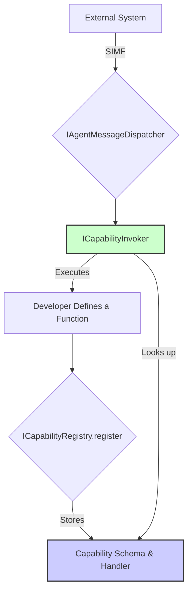

# Agent Capability Management Interfaces

This document defines the core interfaces for registering, discovering, and invoking agent capabilities within the OpenMAS framework. These interfaces provide the programmatic foundation for an agent's skill set.

## Overview

Capability management is composed of three key concepts:

1.  **Capability Schema (`Capability`)**: A structured, declarative definition of a single capability, including its inputs and outputs. This is defined using a Pydantic model.
2.  **Capability Registry (`ICapabilityRegistry`)**: A central repository where all of an agent's capabilities are registered and can be discovered.
3.  **Capability Invoker (`ICapabilityInvoker`)**: An execution engine that handles the invocation of a registered capability, including input validation and dispatching to the correct implementation.



## Interface Definitions

### `Capability` Schema

This Pydantic model defines the structure of a capability. It serves as a machine-readable contract for what a capability does, what it requires, and what it returns.

```python
from typing import Any, Callable, Coroutine, Dict, List, Optional
from pydantic import BaseModel, Field, JsonSchemaValue

# Type hint for the actual function that implements the capability
CapabilityHandler = Callable[..., Coroutine[Any, Any, Any]]

class Capability(BaseModel):
    """A structured representation of an agent's capability."""
    name: str = Field(..., description="The unique name of the capability, e.g., 'weather.get_forecast'.")
    description: str = Field(..., description="A human-readable description of what the capability does.")
    parameters_schema: Dict[str, Any] = Field(
        default_factory=dict,
        description="A JSON Schema object defining the input parameters for the capability."
    )
    returns_schema: Dict[str, Any] = Field(
        default_factory=dict,
        description="A JSON Schema object defining the return value of the capability."
    )
    handler: CapabilityHandler = Field(..., description="The actual coroutine function that executes the capability logic.", exclude=True)

    class Config:
        arbitrary_types_allowed = True
```

### `ICapabilityRegistry`

The registry is the central catalog for an agent's capabilities.

```python
from abc import ABC, abstractmethod
from typing import List, Optional

class ICapabilityRegistry(ABC):
    """Interface for a registry of agent capabilities."""

    @abstractmethod
    async def register_capability(self, capability: Capability) -> None:
        """Registers a capability with the registry.

        Args:
            capability: The capability schema and handler to register.

        Raises:
            ValueError: If a capability with the same name is already registered.
        """
        pass

    @abstractmethod
    async def get_capability(self, name: str) -> Optional[Capability]:
        """Retrieves a single capability by its name.

        Args:
            name: The name of the capability to retrieve.

        Returns:
            The Capability object if found, otherwise None.
        """
        pass

    @abstractmethod
    async def list_capabilities(self) -> List[Capability]:
        """Lists all registered capabilities.

        Returns:
            A list of all registered Capability objects.
        """
        pass
```

### `ICapabilityInvoker`

The invoker is responsible for the runtime execution of a capability.

```python
from abc import ABC, abstractmethod
from typing import Any, Dict

class ICapabilityInvoker(ABC):
    """Interface for invoking a capability.

    This component validates inputs against the capability's schema
    and executes the associated handler.
    """

    @abstractmethod
    async def invoke(self, name: str, arguments: Dict[str, Any]) -> Any:
        """Invokes a capability by name with the given arguments.

        Args:
            name: The name of the capability to invoke.
            arguments: A dictionary of arguments to pass to the capability.

        Returns:
            The result of the capability's execution.

        Raises:
            ValueError: If the capability is not found.
            ValidationError: If the provided arguments do not match the capability's parameters_schema.
        """
        pass
```

## Example Usage

```python
import asyncio

# 1. Define a function to be exposed as a capability
async def get_weather(location: str, unit: str = "celsius") -> Dict[str, Any]:
    """Fetches the current weather for a given location."""
    # In a real implementation, this would call a weather API
    return {"location": location, "temperature": 22, "unit": unit, "condition": "sunny"}

# 2. Create a Capability schema for it
weather_capability = Capability(
    name="weather.get_forecast",
    description="Fetches the current weather for a given location.",
    parameters_schema={
        "type": "object",
        "properties": {
            "location": {"type": "string", "description": "The city and state, e.g., 'San Francisco, CA'"},
            "unit": {"type": "string", "enum": ["celsius", "fahrenheit"], "default": "celsius"}
        },
        "required": ["location"]
    },
    returns_schema={
        "type": "object",
        "properties": {
            "location": {"type": "string"},
            "temperature": {"type": "number"},
            "unit": {"type": "string"},
            "condition": {"type": "string"}
        }
    },
    handler=get_weather
)

# 3. Register it with the registry
# (Assuming 'registry' is an implementation of ICapabilityRegistry)
# await registry.register_capability(weather_capability)

# 4. Invoke it via the invoker
# (Assuming 'invoker' is an implementation of ICapabilityInvoker)
# result = await invoker.invoke(
#     name="weather.get_forecast",
#     arguments={"location": "Palo Alto, CA"}
# )
# print(result) # -> {'location': 'Palo Alto, CA', 'temperature': 22, 'unit': 'celsius', 'condition': 'sunny'}
```
