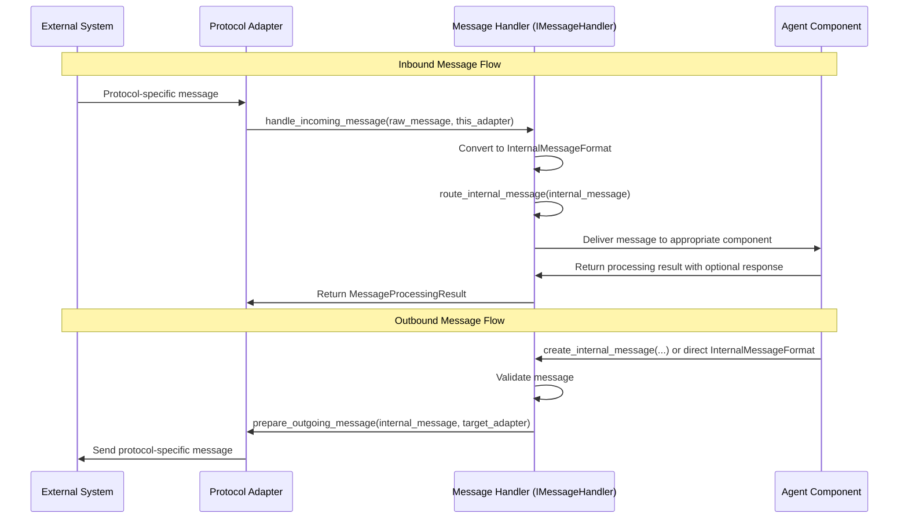

# IMessageHandler Interface

## Overview

The `IMessageHandler` interface defines the standard contract for protocol-agnostic message processing within the OpenMAS Agent Framework. It serves as the critical mediator between protocol-specific adapters and agent reasoning components, ensuring consistent message handling across different communication protocols.

This interface enables the Agent Framework to:

1. Process incoming messages from any supported protocol into a standardized internal format
2. Route messages to appropriate agent capabilities or reasoning components
3. Transform outgoing messages from internal format to protocol-specific formats
4. Maintain protocol agnosticism throughout the agent's core processing logic

## Interface Definition

```python
from abc import ABC, abstractmethod
from typing import Any, Dict, Optional

from openmas.protocol.interfaces.iprotocol_adapter import IProtocolAdapter
from openmas.agents.models.internal_message_format import InternalMessageFormat
from openmas.agents.models.message_processing import MessageProcessingResult, MessageProcessingStatus


class IMessageHandler(ABC):
    """
    Interface for protocol-agnostic message handling within the Agent Framework.

    The IMessageHandler serves as the bridge between protocol-specific adapters
    and an agent's internal processing logic, ensuring consistent message handling
    regardless of the source or target protocol.
    """

    @abstractmethod
    async def handle_incoming_message(
        self,
        raw_message_data: Any,
        source_protocol_adapter: IProtocolAdapter
    ) -> MessageProcessingResult:
        """
        Process an incoming message from a protocol adapter.

        This method:
        1. Converts the raw message data to the standard internal message format
        2. Routes the message to the appropriate agent logic or capability
        3. Returns a result indicating the status of the message processing

        Args:
            raw_message_data: The data as received from the protocol adapter,
                format depends on the specific protocol
            source_protocol_adapter: Instance of the adapter that received the message,
                used for protocol-specific message parsing

        Returns:
            MessageProcessingResult: Object containing the processing status,
                any generated internal message, and potential error information

        Raises:
            MessageFormatError: If the message cannot be parsed into the internal format
            InvalidMessageError: If the message is well-formed but invalid for processing
            MessageRoutingError: If the message cannot be routed to an appropriate handler
        """
        pass

    @abstractmethod
    async def prepare_outgoing_message(
        self,
        internal_message: InternalMessageFormat,
        target_protocol_adapter: IProtocolAdapter,
        protocol_specific_options: Optional[Dict[str, Any]] = None
    ) -> Any:
        """
        Convert an internal message to a protocol-specific format for sending.

        This method:
        1. Takes a message in the standard internal format
        2. Uses the provided protocol adapter to convert it to a protocol-specific format
        3. Applies any necessary protocol-specific transformations or options

        Args:
            internal_message: The message in the agent's standard internal format
            target_protocol_adapter: The protocol adapter that will send the message
            protocol_specific_options: Optional parameters specific to the target protocol

        Returns:
            Any: The message converted to the protocol-specific format expected by the adapter

        Raises:
            MessageFormatError: If the internal message cannot be converted to the target format
            UnsupportedMessageTypeError: If the message type is not supported by the target protocol
        """
        pass

    @abstractmethod
    async def route_internal_message(
        self,
        internal_message: InternalMessageFormat
    ) -> MessageProcessingResult:
        """
        Route an internal message to the appropriate agent component.

        This method:
        1. Analyzes the message type and payload
        2. Determines the appropriate handler (capability, reasoning engine, etc.)
        3. Delivers the message to the handler
        4. Returns the result of the processing

        Args:
            internal_message: The message in the standard internal format

        Returns:
            MessageProcessingResult: Object containing the processing status,
                any response message, and potential error information

        Raises:
            MessageRoutingError: If the message cannot be routed to an appropriate handler
            CapabilityNotFoundError: If the message targets a capability that doesn't exist
        """
        pass

    @abstractmethod
    async def create_internal_message(
        self,
        message_type: str,
        payload: Any,
        target_agent_id: str,
        source_agent_id: Optional[str] = None,
        session_id: Optional[str] = None,
        metadata: Optional[Dict[str, Any]] = None
    ) -> InternalMessageFormat:
        """
        Create a new internal message with the standard format.

        This is a helper method for components that need to generate messages
        internally without receiving them from a protocol adapter.

        Args:
            message_type: Type of the message (see MessageType enum)
            payload: The message payload (must match a valid payload type)
            target_agent_id: ID of the agent that should receive this message
            source_agent_id: Optional ID of the sending agent
            session_id: Optional conversation/session ID
            metadata: Optional additional metadata for the message

        Returns:
            InternalMessageFormat: A properly formatted internal message

        Raises:
            InvalidPayloadError: If the payload doesn't match a valid payload type
            InvalidMessageTypeError: If the message type is not recognized
        """
        pass
```

## Supporting Data Structures

### MessageProcessingStatus

The `MessageProcessingStatus` enum defines the possible states of message processing:

```python
from enum import Enum

class MessageProcessingStatus(str, Enum):
    """
    Status of message processing within the Agent Framework.
    """
    RECEIVED = "received"         # Message was received by the handler
    PARSED = "parsed"             # Message was successfully parsed into internal format
    ROUTING = "routing"           # Message is being routed to a handler
    PROCESSING = "processing"     # Message is being processed by a handler
    COMPLETED = "completed"       # Message was successfully processed
    RESPONSE_READY = "response_ready"  # A response to the message is ready
    FAILED = "failed"             # Message processing failed
    REJECTED = "rejected"         # Message was rejected (e.g., invalid format)
    DEFERRED = "deferred"         # Message processing was deferred
```

### MessageProcessingResult

The `MessageProcessingResult` class captures the outcome of message processing:

```python
from typing import Any, Dict, Optional
from pydantic import BaseModel, Field

from openmas.agents.models.internal_message_format import InternalMessageFormat

class MessageProcessingResult(BaseModel):
    """
    Result of message processing within the Agent Framework.
    """
    status: MessageProcessingStatus = Field(
        ...,
        description="Status of the message processing"
    )
    internal_message: Optional[InternalMessageFormat] = Field(
        None,
        description="The processed internal message if available"
    )
    response_message: Optional[InternalMessageFormat] = Field(
        None,
        description="Response message if one was generated"
    )
    error_message: Optional[str] = Field(
        None,
        description="Error message if processing failed"
    )
    error_details: Optional[Dict[str, Any]] = Field(
        None,
        description="Detailed error information if processing failed"
    )
    metadata: Dict[str, Any] = Field(
        default_factory=dict,
        description="Additional metadata about the processing"
    )
```

## Message Flow Sequence Diagram

The following diagram illustrates the flow of a message through the IMessageHandler interface:



## Implementation Considerations

### Protocol Adapter Integration

The IMessageHandler interface works closely with the IProtocolAdapter interface. Protocol adapters are responsible for:

1. Receiving raw messages from their specific protocol
2. Passing those messages to the message handler via `handle_incoming_message()`
3. Receiving protocol-specific formatted messages from `prepare_outgoing_message()`
4. Sending those messages via their protocol-specific mechanisms

### Error Handling

The IMessageHandler interface defines several potential error conditions:

- **MessageFormatError**: When messages cannot be parsed or formatted
- **InvalidMessageError**: When messages are well-formed but semantically invalid
- **MessageRoutingError**: When messages cannot be routed to an appropriate handler
- **CapabilityNotFoundError**: When messages target non-existent capabilities
- **UnsupportedMessageTypeError**: When message types aren't supported by a protocol

Implementations should provide detailed error information through the `MessageProcessingResult` structure.

## Example Usage

### Handling an Incoming Message

```python
# In a Protocol Adapter implementation
async def on_message_received(self, raw_message):
    # Protocol adapter receives message from external source
    processing_result = await self.message_handler.handle_incoming_message(
        raw_message_data=raw_message,
        source_protocol_adapter=self
    )

    if processing_result.status == MessageProcessingStatus.RESPONSE_READY:
        # We have a response to send back
        response_data = await self.message_handler.prepare_outgoing_message(
            internal_message=processing_result.response_message,
            target_protocol_adapter=self
        )
        await self.send_message(response_data)
    elif processing_result.status == MessageProcessingStatus.FAILED:
        # Log error and potentially notify sender
        self.logger.error(
            f"Message processing failed: {processing_result.error_message}",
            details=processing_result.error_details
        )
```

### Creating and Sending a Message

```python
# In an agent component
async def notify_user_of_completion(self, task_id, result):
    # Create an internal message
    message = await self.message_handler.create_internal_message(
        message_type="TASK_COMPLETE",
        payload={
            "payload_type": "structured_data_content",
            "data": {
                "task_id": task_id,
                "status": "completed",
                "result": result
            }
        },
        target_agent_id="user-interface",
        source_agent_id=self.agent_id,
        session_id=self.current_session_id,
        metadata={"priority": "high"}
    )

    # Get the protocol adapter for the target
    protocol_adapter = await self.protocol_manager.get_adapter_for_agent("user-interface")

    # Prepare and send the message
    protocol_message = await self.message_handler.prepare_outgoing_message(
        internal_message=message,
        target_protocol_adapter=protocol_adapter
    )

    await protocol_adapter.send_message(protocol_message)
```

## Relationship to Other Components

The IMessageHandler interface is a key part of OpenMAS's reasoning agnostic design, enabling:

1. **Protocol Agnosticism**: By providing a standard interface between protocol adapters and agent components, allowing agents to communicate over multiple protocols without protocol-specific logic in their core processing.

2. **Reasoning Agnosticism**: By abstracting message handling from reasoning implementation, allowing different reasoning engines to receive standardized message formats.

3. **Clean Separation**: Maintaining the separation between agent communication infrastructure (the "body") and decision-making logic (the "brain").

For more information on how this interface relates to other components, see:
- [Agent Framework Overview](../agent_framework_overview.md)
- [Protocol Adapter Interface](../../02_protocols/iprotocol_adapter_interface.md)
- [Internal Message Format Standard](../../01_architecture/internal_message_format_standard.md)
