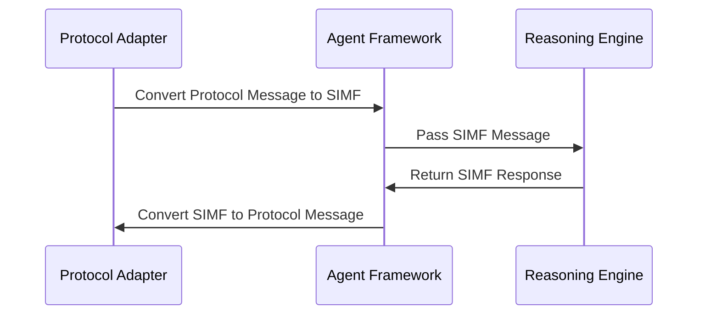

# Agent Reasoning Approaches

## Overview

This document details the various reasoning engines ("brains") supported by OpenMAS, highlighting the framework's distinctive reasoning agnosticism that separates agent communication infrastructure ("body") from reasoning approaches ("brain"). Each agent in OpenMAS is configured with a primary `reasoning.approach` which determines its main `ReasoningEngine`.

## Reasoning Agnosticism

OpenMAS implements reasoning agnosticism through:

1. **Clean Separation** - Communication infrastructure ("body") and reasoning engines ("brain") are fully decoupled
2. **Common Interfaces** - Standardized interfaces across all reasoning engines
3. **Protocol Independence** - Reasoning is independent of communication protocols
4. **Uniform Capabilities** - Agent capabilities can be implemented using any reasoning approach
5. **Knowledge Access** - All reasoning engines access knowledge through standardized interfaces like `IKnowledgeBase` provided by the KR&R System

> **Important**: Reasoning engines (the "brains") implement an agent's primary decision-making logic, while the KR&R System serves as a knowledge management service that provides these engines with access to knowledge. The KR&R System itself is not a reasoning engine but rather a supporting service that manages knowledge representations and provides standardized access to them via interfaces defined in `/09_knowledge_representation/knowledge_access_interfaces/`.

## SIMF Payload Types and Reasoning Integration

The Standard Internal Message Format (SIMF) provides a comprehensive set of payload types that serve as the interface between the agent's communication layer and its reasoning engine. Each reasoning approach can effectively leverage specific SIMF payload types based on its processing requirements and paradigm.

### SIMF to Reasoning Engine Flow

The Agent Framework receives messages in protocol-specific formats, which Protocol Adapters convert to SIMF. These SIMF messages are then passed to the appropriate reasoning engine based on the agent's configured `reasoning.approach`. The reasoning engine processes these messages and returns SIMF-formatted responses.



### Reasoning Engine Usage of SIMF Payload Types

Different reasoning engines process SIMF messages in ways aligned with their paradigms:

| Reasoning Approach | Primary SIMF Payload Types | Usage Patterns |
|--------------------|----------------------------|----------------|
| **Rule-Based** | `structured_data_content`, `knowledge_representation_content` | Rule engines process structured data directly and can leverage the formal knowledge structures for rule evaluation. |
| **BDI** | `knowledge_representation_content`, `event_content`, `structured_data_content` | BDI engines map events to desires and can represent beliefs using the knowledge representation format. |
| **LLM-Based** | `text_content`, `multi_part_content`, `asset_reference_content` | LLM engines primarily process text but can incorporate multiple content types as context. |
| **Symbolic KR&R** | `knowledge_representation_content`, `structured_data_content` | These engines directly leverage formal knowledge structures in their preferred formalism. |
| **Hybrid** | All payload types | Hybrid approaches selectively route payloads to appropriate sub-engines based on content type. |

### Newly Enhanced SIMF Payload Types

1. **`knowledge_representation_content`**: Especially valuable for symbolic reasoning and BDI engines, this payload type enables representing formal knowledge structures with specific formalisms (predicate logic, description logic, RDF, etc.). Example usage:

```python
# BDI engine processing a knowledge representation payload
def process_simf_message(self, message):
    if message.payload.payload_type == "knowledge_representation_content":
        if message.payload.formalism == "predicate_logic":
            # Add as belief
            self.belief_base.add(message.payload.representation)
        elif message.payload.operation == "query":
            # Process as query against belief base
            result = self.belief_base.query(message.payload.representation)
```

2. **`stream_context_content`**: Enables processing streamed information from protocols like gRPC or SSE while maintaining context:

```python
# Stream processing in an LLM reasoner
def process_stream(self, messages):
    # Group by stream_id
    streams = {}
    for msg in messages:
        if msg.payload.payload_type == "stream_context_content":
            if msg.payload.stream_id not in streams:
                streams[msg.payload.stream_id] = []
            streams[msg.payload.stream_id].append(msg)

    # Process each stream as a coherent sequence
    for stream_id, stream_msgs in streams.items():
        sorted_msgs = sorted(stream_msgs, key=lambda m: m.payload.sequence_number)
        self.process_stream_sequence(sorted_msgs)
```

3. **`event_content`**: Particularly useful for event-driven reasoning like BDI and rule-based approaches:

```python
# Rule engine processing an event
def process_event(self, message):
    if message.payload.payload_type == "event_content":
        # Add event to working memory
        self.working_memory.add_fact({
            "event_type": message.payload.event_type,
            "source": message.payload.event_source,
            "data": message.payload.data,
            "timestamp": message.payload.timestamp
        })

        # Trigger event-specific rules
        self.evaluate_rules_for_event_type(message.payload.event_type)
```

For complete details on all SIMF payload types and their structure, see [Standard Internal Message Format](/refactoring_work/00b_overview/01_architecture/internal_message_format_standard.md).

## Supported Reasoning Engines

Each agent in OpenMAS is configured with a primary `reasoning.approach`, which selects one of the following reasoning engines to serve as the agent's "brain":

### 1. Rule-Based Reasoning

Rule-based reasoning is a straightforward but powerful approach that uses explicit if-then statements to make decisions and take actions. This approach is particularly well-suited for domains with clear, deterministic rules and where explainability is critical.

```python
from openmas.agent import Agent
from openmas.reasoning.rule_based import RuleEngine, Rule, Condition, Action

class SecurityAgent(Agent):
    async def setup(self):
        # Create rule engine with specific configuration
        self.rule_engine = RuleEngine(
            engine_type="forward_chaining",
            conflict_resolution="priority",
            max_iterations=100
        )

        # Define rules programmatically
        self.rule_engine.add_rules([
            "IF sensor.motion = True AND time.period = 'night' THEN alert('Motion detected during night')",
            "IF sensor.smoke > 50 THEN alert('Smoke detected') AND activate('sprinklers')",
            "IF sensor.temperature > 30 THEN activate('cooling')"
        ])

        # Define rules using object model for more complex scenarios
        complex_rule = Rule(
            name="intrusion_detection",
            priority=10,
            conditions=[
                Condition("sensor.door = 'open'"),
                Condition("security.armed = True"),
                Condition("NOT user.present = True")
            ],
            actions=[
                Action("alert('Possible intrusion detected')"),
                Action("activate('alarm')"),
                Action("notify('security_team')")
            ]
        )
        self.rule_engine.add_rule(complex_rule)

        # Load rules from external file
        await self.rule_engine.load_rules_from_file("security_rules.yml")

        # Register capabilities
        self.register_capability("check_security")
        self.register_capability("update_rules")

    @capability("check_security")
    async def check_security(self, sensors):
        # Update fact base with sensor data
        self.rule_engine.update_facts(sensors)

        # Evaluate rules with different inference settings
        actions = self.rule_engine.evaluate(
            inference_depth=3,
            explain=True,  # Generate explanation of reasoning
            uncertainty_threshold=0.8  # Handle uncertain facts
        )

        # Execute resulting actions
        results = []
        for action in actions:
            success = await self.execute_action(action)
            results.append({
                "action": action.name,
                "success": success,
                "parameters": action.parameters,
                "explanation": action.explanation
            })

        return {
            "detected_issues": len(results),
            "actions_taken": results,
            "inference_path": self.rule_engine.get_inference_path()
        }

    @capability("update_rules")
    async def update_rules(self, new_rules, override=False):
        """Dynamic rule update capability."""
        if override:
            self.rule_engine.clear_rules()

        added_rules = self.rule_engine.add_rules(new_rules)
        return {"rules_added": len(added_rules), "rules_total": self.rule_engine.rule_count}
```

**Key Features:**
- **Rule Types**:
  - Simple conditional (if-then) rules
  - Complex pattern matching rules
  - Temporal reasoning rules
  - Uncertainty handling rules

- **Inference Mechanisms**:
  - Forward chaining (data-driven)
  - Backward chaining (goal-driven)
  - Mixed chaining strategies

- **Conflict Resolution**:
  - Priority-based resolution
  - Specificity-based resolution
  - Recency-based resolution

- **Explainability**:
  - Reasoning trace generation
  - Inference path visualization
  - Decision justification

- **Integration Features**:
  - Dynamic rule updates
  - External knowledge source integration
  - Fact verification and validation trees
- Certainty factors

### 2. BDI Architecture

Belief-Desire-Intention architecture for cognitive agents:

```python
from openmas.agent import Agent
from openmas.reasoning.bdi import BeliefBase, DesireSet, PlanLibrary, IntentionStructure

class DeliveryAgent(Agent):
    async def setup(self):
        # Initialize BDI components
        self.belief_base = BeliefBase()
        self.desire_set = DesireSet()
        self.plan_library = PlanLibrary()
        self.intention_structure = IntentionStructure()

        # Add initial beliefs
        self.belief_base.add("at(depot)")
        self.belief_base.add("packages", [
            {"id": "p1", "destination": "location_a"},
            {"id": "p2", "destination": "location_b"}
        ])

        # Add desires (goals)
        self.desire_set.add_desire("deliver_all_packages", priority=10)

        # Add plans
        self.plan_library.add_plan(
            "deliver_package",
            trigger="deliver_package(?p)",
            context="at(?loc) AND not at(?p.destination)",
            body=[
                "!navigate_to(?p.destination)",
                "drop_package(?p)",
                "!navigate_to(depot)"
            ]
        )

        self.plan_library.add_plan(
            "deliver_all",
            trigger="deliver_all_packages",
            body=["!deliver_package(?p) FOR_EACH ?p IN packages"]
        )

        # Register capabilities
        self.register_capability("start_deliveries")
        self.register_capability("add_package")

    @capability("start_deliveries")
    async def start_deliveries(self):
        # Add intention to deliver all packages
        self.intention_structure.add_intention("deliver_all_packages")

        # Run BDI reasoning cycle
        while self.intention_structure.has_intentions():
            await self.bdi_cycle()

        return {"status": "completed", "packages_delivered": len(self.belief_base.query("packages"))}
```

**Key Features:**
- Belief management (knowledge about the world)
- Desire representation (goals to achieve)
- Intention management (plans to execute)
- Plan selection and execution
- Commitment strategies

### 3. Symbolic Reasoning Engine

Sophisticated reasoning using symbolic knowledge representation and inference:

```python
from openmas.agent import Agent
from openmas.reasoning.symbolic import SymbolicEngine
from openmas.knowledge import KnowledgeBaseClient

class DiagnosticAgent(Agent):
    async def setup(self):
        # Initialize Symbolic Reasoning Engine
        self.symbolic_engine = SymbolicEngine(
            reasoning_methods=["deductive", "abductive"]
        )

        # Connect to KR&R System-managed knowledge bases (configured in knowledge_management_config)
        self.kb_client = KnowledgeBaseClient()
        self.medical_kb = await self.kb_client.get_knowledge_base("medical_ontology")
        self.rules_kb = await self.kb_client.get_knowledge_base("diagnostic_rules")

        # Register capabilities
        self.register_capability("diagnose")

    @capability("diagnose")
    async def diagnose(self, symptoms):
        # Assert symptoms as facts using the KR&R System's knowledge base interface
        for symptom in symptoms:
            await self.medical_kb.add(f"hasSymptom(patient, {symptom})")

        # Perform reasoning to determine possible conditions
        possible_conditions = await self.symbolic_engine.infer(
            query="hasCondition(patient, ?condition)",
            knowledge_base=self.medical_kb,
            reasoning_type="abductive"
        )

        # Determine confidence for each condition
        results = []
        for condition in possible_conditions:
            confidence = await self.symbolic_engine.calculate_certainty(
                fact=f"hasCondition(patient, {condition})",
                knowledge_base=self.medical_kb
            )
            results.append({"condition": condition, "confidence": confidence})

        # Sort by confidence
        results.sort(key=lambda x: x["confidence"], reverse=True)

        return {
            "diagnosis": results,
            "explanation": await self.symbolic_engine.explain(results[0]["condition"])
        }
```

**Key Features:**
- Symbolic reasoning with formal logic
- Inference methods (deductive, inductive, abductive)
- Temporal and spatial reasoning capabilities
- Uncertainty handling and non-monotonic reasoning
- Leverages the KR&R System for knowledge management

### 4. LLM-Based Reasoning

Language Model driven reasoning:

```python
from openmas.agent import Agent
from openmas.reasoning.llm import LLMReasoner

class CustomerSupportAgent(Agent):
    async def setup(self):
        # Initialize LLM reasoner
        self.llm = await LLMReasoner.create(
            provider=self.config.get("reasoning.llm.provider", "openai"),
            model=self.config.get("reasoning.llm.model", "gpt-4"),
            system_prompt="You are a helpful customer support agent."
        )

        # Set up memory
        self.memory = self.llm.create_memory(
            memory_type="conversation_buffer",
            max_tokens=10000
        )

        # Load knowledge base
        self.knowledge = await self.load_knowledge("customer_support_kb")

        # Register capabilities
        self.register_capability("answer_question")
        self.register_capability("escalate_issue")

    @capability("answer_question")
    async def answer_question(self, question, conversation_id=None):
        # Retrieve relevant knowledge
        relevant_docs = await self.knowledge.query(question)

        # Generate response with LLM
        response = await self.llm.generate(
            prompt=question,
            conversation_id=conversation_id,
            memory=self.memory,
            context=relevant_docs,
            max_tokens=1000
        )

        return {
            "answer": response.text,
            "sources": response.metadata.get("sources", []),
            "confidence": response.metadata.get("confidence", 0.0)
        }
```

**Key Features:**
- Prompt engineering
- Context management
- Tool usage
- Memory and retrieval augmentation
- Chain-of-thought reasoning

### 5. Hybrid Reasoning

Combinations of multiple reasoning approaches:

```python
from openmas.agent import Agent
from openmas.reasoning.hybrid import HybridEngine
from openmas.reasoning.llm import LLMReasoner
from openmas.reasoning.rule_based import RuleEngine
from openmas.reasoning.bdi import BDIEngine

class FinancialAdvisorAgent(Agent):
    async def setup(self):
        # Initialize component reasoners
        self.rule_engine = RuleEngine()
        self.rule_engine.load_rules("financial_rules.yml")

        self.llm = await LLMReasoner.create(
            provider="openai",
            model="gpt-4"
        )

        self.bdi = BDIEngine()
        self.bdi.load_plans("financial_plans.yml")

        # Create hybrid reasoner
        self.reasoner = HybridEngine([
            ("rule_engine", self.rule_engine, {"priority": 1}),
            ("llm", self.llm, {"priority": 2}),
            ("bdi", self.bdi, {"priority": 3})
        ])

        # Configure reasoning flow
        self.reasoner.configure_flow({
            "regulatory_compliance": "rule_engine",
            "personalized_advice": "llm",
            "financial_planning": "bdi",
            "fallback": "llm"
        })

        # Register capabilities
        self.register_capability("provide_investment_advice")

    @capability("provide_investment_advice")
    async def provide_investment_advice(self, client_profile, preferences):
        # Regulatory compliance check using rules
        compliance = await self.reasoner.reason(
            "regulatory_compliance",
            {"profile": client_profile, "preferences": preferences}
        )

        if not compliance.get("compliant", False):
            return {"status": "rejected", "reason": compliance.get("reason")}

        # Generate personalized advice using LLM
        advice = await self.reasoner.reason(
            "personalized_advice",
            {"profile": client_profile, "preferences": preferences}
        )

        # Create financial plan using BDI
        plan = await self.reasoner.reason(
            "financial_planning",
            {"profile": client_profile, "preferences": preferences, "advice": advice}
        )

        return {
            "status": "success",
            "advice": advice.get("recommendation"),
            "plan": plan.get("steps"),
            "reasoning": advice.get("reasoning")
        }
```

**Key Features:**
- Multiple reasoning approaches in a single agent
- Task-specific reasoning selection
- Cascading reasoning flows
- Reasoning composition
- Conflict resolution strategies

## Reasoning Implementation

### Base Reasoning Interface

All reasoning approaches implement a common interface:

```python
class BaseReasoner:
    """Base class for all reasoning approaches."""

    def __init__(self, config=None):
        self.config = config or {}

    async def initialize(self):
        """Initialize the reasoner."""
        raise NotImplementedError

    async def reason(self, input_data, context=None):
        """Perform reasoning on the input data."""
        raise NotImplementedError

    async def explain(self, reasoning_result):
        """Explain the reasoning process for a result."""
        raise NotImplementedError

    async def update(self, new_knowledge):
        """Update the reasoner's knowledge."""
        raise NotImplementedError

    async def cleanup(self):
        """Clean up resources."""
        pass
```

### Reasoning Integration with Capabilities

Capabilities can be associated with specific reasoning approaches:

```python
class MultiReasoningAgent(Agent):
    async def setup(self):
        # Create multiple reasoners
        self.llm_reasoner = await LLMReasoner.create(provider="openai", model="gpt-4")
        self.rule_reasoner = RuleEngine()
        self.rule_reasoner.load_rules("business_rules.yml")

        # Register capabilities with specific reasoners
        self.register_capability(
            name="generate_content",
            description="Generate creative content",
            reasoner="llm"  # Use LLM for creative tasks
        )

        self.register_capability(
            name="validate_transaction",
            description="Validate a financial transaction",
            reasoner="rule"  # Use rules for compliance
        )

    @capability("generate_content", reasoner="llm")
    async def generate_content(self, topic, length):
        return await self.llm_reasoner.generate({
            "topic": topic,
            "length": length
        })

    @capability("validate_transaction", reasoner="rule")
    async def validate_transaction(self, transaction):
        return self.rule_reasoner.evaluate({
            "transaction": transaction
        })
```

## Reasoning Configuration

For reasoning configuration, OpenMAS uses the unified configuration schema. For the complete schema definition, see [Agent Configuration Schema](/03_configuration/schema/agents.md).

Key configuration sections:

```yaml
agents:
  finance_agent:
    class: "agents.finance.FinancialAdvisorAgent"
    type: "hybrid"

    # Reasoning configuration
    reasoning:
      approach: "hybrid"

      # LLM reasoning configuration
      llm:
        provider: "openai"
        model: "gpt-4"
        temperature: 0.2
        system_prompt: "You are a financial advisor..."
        tools_enabled: true

      # Rule-based reasoning configuration
      rule_based:
        engine: "standard"
        rules_file: "rules/financial_rules.yml"
        inference: "forward"

      # BDI reasoning configuration
      bdi:
        belief_base:
          type: "in_memory"
        desires:
          - name: "optimize_portfolio"
            priority: 10
        plans:
          - name: "diversify_investments"
            triggers: ["optimize_portfolio"]

      # Hybrid reasoning flow
      hybrid:
        flow:
          - task: "regulatory_check"
            reasoner: "rule_based"
          - task: "investment_advice"
            reasoner: "llm"
          - task: "portfolio_planning"
            reasoner: "bdi"
```

## Reasoning Agnosticism Integration

The OpenMAS agent framework enables the consistent use of different reasoning approaches through these mechanisms:

1. **Common Capability Interface** - Same capability definition with different reasoning implementations
2. **Reasoning Selection** - Dynamic selection of reasoning approach based on task
3. **Knowledge Sharing** - Common knowledge representation across reasoning approaches
4. **Protocol Independence** - Reasoning works with any communication protocol
5. **Unified Configuration** - Consistent configuration regardless of reasoning approach

This enables developers to choose the most appropriate reasoning approach for each agent while maintaining consistent communication and integration with the rest of the system.
