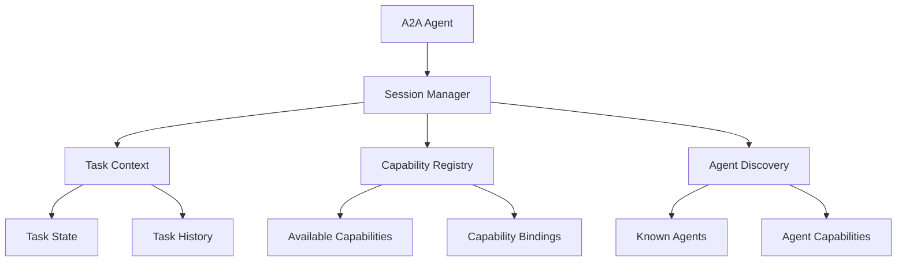

# A2A Task Integration with Session Management

This document describes how OpenMAS session management integrates with the Agent-to-Agent (A2A) protocol, specifically focusing on task-based interactions and capability management.

## Overview

The A2A protocol integration with session management provides:
- Task-aware session contexts
- Capability-based session routing
- Agent discovery within session contexts
- Task delegation and coordination
- Multi-agent task execution tracking

## A2A Session Architecture

### Session-Task Relationship



### Core Components

1. **Task Context Manager**: Maintains task-specific session state
2. **Capability Session Router**: Routes messages based on required capabilities
3. **Agent Discovery Cache**: Caches agent discovery within session scope
4. **Task Coordination Engine**: Manages multi-agent task execution

## Configuration

### Basic A2A Session Configuration

```yaml
sessions:
  enabled: true
  protocol_sessions:
    a2a:
      enabled: true
      task_management:
        enabled: true
        max_concurrent_tasks: 10
        task_timeout: 3600  # 1 hour
        auto_cleanup: true
      capability_tracking:
        enabled: true
        cache_duration: 300  # 5 minutes
        auto_refresh: true
      agent_discovery:
        enabled: true
        discovery_cache: true
        cache_ttl: 600  # 10 minutes
```

### Advanced A2A Session Configuration

```yaml
sessions:
  enabled: true
  protocol_sessions:
    a2a:
      enabled: true
      task_management:
        delegation:
          enabled: true
          max_delegation_depth: 3
          delegation_strategy: "capability_based"
        coordination:
          enabled: true
          coordination_pattern: "hierarchical"
          consensus_required: false
        persistence:
          enabled: true
          persist_task_state: true
          persist_intermediate_results: true
      capability_matching:
        algorithm: "semantic"
        similarity_threshold: 0.8
        fallback_enabled: true
```

## Implementation Patterns

### 1. Task-Aware Agent

```python
from openmas.agent import BaseAgent
from openmas.core.simf import SIMFMessage
from openmas.protocols.a2a import A2ATaskMessage, A2ACapability

class A2ATaskAgent(BaseAgent):
    def __init__(self, config):
        super().__init__(config)
        self.capabilities = self._load_capabilities()

    async def process_message(self, message: SIMFMessage) -> SIMFMessage:
        # Convert SIMF to A2A if needed
        if message.protocol != "a2a":
            a2a_message = await self.convert_to_a2a(message)
        else:
            a2a_message = message

        # Check if this is a task-related message
        if isinstance(a2a_message, A2ATaskMessage):
            return await self.process_task_message(a2a_message)
        else:
            return await super().process_message(a2a_message)

    async def process_task_message(self, message: A2ATaskMessage) -> SIMFMessage:
        # Get or create task session
        task_session = await self.get_task_session(message.task_id)

        # Check if we have required capabilities
        required_caps = message.required_capabilities
        if not self.has_capabilities(required_caps):
            # Delegate to capable agent
            return await self.delegate_task(message, required_caps)

        # Process task within session context
        result = await self.execute_task(message, task_session)

        # Update task state
        await task_session.update_task_state(message.task_id, {
            "status": "completed" if result.success else "failed",
            "result": result.data,
            "timestamp": datetime.utcnow()
        })

        return result

    async def delegate_task(self, message: A2ATaskMessage, required_caps: List[A2ACapability]) -> SIMFMessage:
        # Find agents with required capabilities
        capable_agents = await self.discover_capable_agents(required_caps)

        if not capable_agents:
            return SIMFMessage(
                content="No capable agents found",
                message_type="error",
                protocol="a2a"
            )

        # Select best agent (could be based on load, capability score, etc.)
        selected_agent = self.select_best_agent(capable_agents, required_caps)

        # Create delegation message
        delegation_msg = A2ATaskMessage(
            task_id=message.task_id,
            content=message.content,
            required_capabilities=required_caps,
            delegated_by=self.agent_id,
            target_agent=selected_agent.agent_id
        )

        # Send delegation and track in session
        session = await self.get_current_session()
        await session.track_delegation(message.task_id, selected_agent.agent_id)

        return await self.send_message(delegation_msg, selected_agent.agent_id)
```

### 2. Capability-Based Session Routing

```python
class A2ACapabilityRouter:
    def __init__(self, session_manager, capability_registry):
        self.session_manager = session_manager
        self.capability_registry = capability_registry

    async def route_message(self, message: A2ATaskMessage, session_id: str) -> str:
        """Route message to appropriate agent based on required capabilities"""

        # Get session context
        session = await self.session_manager.get_session(session_id)

        # Check if current agent can handle the task
        current_agent_caps = await session.get_agent_capabilities()
        required_caps = message.required_capabilities

        if self.capabilities_match(current_agent_caps, required_caps):
            return session.current_agent_id

        # Find best matching agent in session context
        session_agents = await session.get_participating_agents()

        for agent_id in session_agents:
            agent_caps = await self.capability_registry.get_capabilities(agent_id)
            if self.capabilities_match(agent_caps, required_caps):
                return agent_id

        # If no session agent can handle it, discover new agents
        discovered_agents = await self.discover_agents_for_capabilities(required_caps)

        if discovered_agents:
            # Add best agent to session
            best_agent = self.select_best_agent(discovered_agents, required_caps)
            await session.add_participant(best_agent.agent_id)
            return best_agent.agent_id

        return None  # No capable agent found

    def capabilities_match(self, agent_caps: List[A2ACapability], required_caps: List[A2ACapability]) -> bool:
        """Check if agent capabilities satisfy requirements"""

        for required_cap in required_caps:
            if not any(self.capability_satisfies(agent_cap, required_cap) for agent_cap in agent_caps):
                return False
        return True

    def capability_satisfies(self, agent_cap: A2ACapability, required_cap: A2ACapability) -> bool:
        """Check if an agent capability satisfies a requirement"""

        # Exact match
        if agent_cap.name == required_cap.name:
            return True

        # Semantic similarity (if configured)
        if hasattr(self, 'semantic_matcher'):
            similarity = self.semantic_matcher.compare(agent_cap.name, required_cap.name)
            return similarity >= self.capability_threshold

        return False
```

### 3. Multi-Agent Task Coordination

```python
class A2ATaskCoordinator:
    def __init__(self, session_manager):
        self.session_manager = session_manager
        self.active_tasks = {}

    async def coordinate_multi_agent_task(self, task_message: A2ATaskMessage, session_id: str):
        """Coordinate a task across multiple agents within a session"""

        # Parse task for sub-tasks
        sub_tasks = await self.decompose_task(task_message)

        # Create coordination session
        coord_session = await self.session_manager.create_coordination_session(
            parent_session_id=session_id,
            task_id=task_message.task_id,
            coordination_pattern="hierarchical"
        )

        # Assign sub-tasks to agents
        task_assignments = {}
        for sub_task in sub_tasks:
            # Find best agent for this sub-task
            agent_id = await self.find_best_agent_for_subtask(sub_task)

            if agent_id:
                task_assignments[sub_task.id] = agent_id
                await coord_session.assign_subtask(sub_task.id, agent_id)
            else:
                # Handle unassignable sub-task
                await self.handle_unassignable_subtask(sub_task, coord_session)

        # Execute sub-tasks in parallel
        results = await self.execute_subtasks_parallel(task_assignments, coord_session)

        # Aggregate results
        final_result = await self.aggregate_results(results, task_message.task_id)

        # Update main session with results
        main_session = await self.session_manager.get_session(session_id)
        await main_session.update_task_completion(task_message.task_id, final_result)

        return final_result

    async def execute_subtasks_parallel(self, assignments: Dict[str, str], coord_session) -> Dict[str, Any]:
        """Execute sub-tasks in parallel and collect results"""

        async def execute_subtask(subtask_id: str, agent_id: str):
            try:
                # Get sub-task details
                subtask = await coord_session.get_subtask(subtask_id)

                # Create sub-task message
                subtask_msg = A2ATaskMessage(
                    task_id=subtask_id,
                    parent_task_id=coord_session.task_id,
                    content=subtask.content,
                    required_capabilities=subtask.required_capabilities
                )

                # Execute on assigned agent
                result = await self.execute_on_agent(subtask_msg, agent_id)

                # Update coordination session
                await coord_session.update_subtask_result(subtask_id, result)

                return subtask_id, result

            except Exception as e:
                await coord_session.log_subtask_error(subtask_id, str(e))
                return subtask_id, {"error": str(e)}

        # Execute all sub-tasks concurrently
        tasks = [
            execute_subtask(subtask_id, agent_id)
            for subtask_id, agent_id in assignments.items()
        ]

        results = await asyncio.gather(*tasks, return_exceptions=True)

        return {subtask_id: result for subtask_id, result in results}
```

## Session State Management

### Task State Tracking

```python
class A2ATaskSessionState:
    def __init__(self, session_id: str):
        self.session_id = session_id
        self.active_tasks = {}
        self.completed_tasks = {}
        self.task_history = []
        self.agent_assignments = {}

    async def start_task(self, task_id: str, task_data: dict):
        """Start tracking a new task"""
        self.active_tasks[task_id] = {
            "id": task_id,
            "data": task_data,
            "status": "active",
            "started_at": datetime.utcnow(),
            "sub_tasks": {},
            "assigned_agents": []
        }

        self.task_history.append({
            "action": "task_started",
            "task_id": task_id,
            "timestamp": datetime.utcnow()
        })

    async def assign_task_to_agent(self, task_id: str, agent_id: str):
        """Assign task to an agent"""
        if task_id in self.active_tasks:
            self.active_tasks[task_id]["assigned_agents"].append(agent_id)
            self.agent_assignments[agent_id] = self.agent_assignments.get(agent_id, []) + [task_id]

    async def complete_task(self, task_id: str, result: dict):
        """Mark task as completed"""
        if task_id in self.active_tasks:
            task_data = self.active_tasks.pop(task_id)
            task_data["status"] = "completed"
            task_data["completed_at"] = datetime.utcnow()
            task_data["result"] = result

            self.completed_tasks[task_id] = task_data

            self.task_history.append({
                "action": "task_completed",
                "task_id": task_id,
                "timestamp": datetime.utcnow(),
                "result": result
            })

    def get_task_summary(self) -> dict:
        """Get summary of all tasks in this session"""
        return {
            "active_tasks": len(self.active_tasks),
            "completed_tasks": len(self.completed_tasks),
            "total_tasks": len(self.active_tasks) + len(self.completed_tasks),
            "agents_involved": len(set(self.agent_assignments.keys()))
        }
```

## Testing A2A Session Integration

### Task Processing Test

```python
@pytest.mark.asyncio
async def test_a2a_task_session_processing():
    # Create A2A task agent
    agent = A2ATaskAgent(config)

    # Start session
    session_id = await agent.start_session("test_user")

    # Create task message
    task_msg = A2ATaskMessage(
        task_id="test_task_001",
        content="Analyze data and generate report",
        required_capabilities=[
            A2ACapability(name="data_analysis", version="1.0"),
            A2ACapability(name="report_generation", version="1.0")
        ]
    )

    # Process task
    result = await agent.process_message(task_msg, session_id=session_id)

    # Verify task was processed
    assert result.is_successful()

    # Check session state
    session = await agent.get_session(session_id)
    task_state = await session.get_task_state("test_task_001")
    assert task_state["status"] == "completed"
```

### Multi-Agent Coordination Test

```python
@pytest.mark.asyncio
async def test_multi_agent_task_coordination():
    # Create multiple agents with different capabilities
    analyzer_agent = A2ATaskAgent(config_with_analysis_capabilities)
    reporter_agent = A2ATaskAgent(config_with_reporting_capabilities)
    coordinator = A2ATaskCoordinator(session_manager)

    # Start coordination session
    session_id = await coordinator.start_coordination_session([
        analyzer_agent.agent_id,
        reporter_agent.agent_id
    ])

    # Create complex task requiring both capabilities
    complex_task = A2ATaskMessage(
        task_id="complex_task_001",
        content="Analyze sales data and create executive summary",
        required_capabilities=[
            A2ACapability(name="data_analysis", version="1.0"),
            A2ACapability(name="report_generation", version="1.0")
        ]
    )

    # Coordinate task execution
    result = await coordinator.coordinate_multi_agent_task(complex_task, session_id)

    # Verify coordination success
    assert result.is_successful()
    assert "analysis" in result.data
    assert "report" in result.data
```

## Performance Considerations

### Capability Caching

```python
class A2ACapabilityCache:
    def __init__(self, ttl: int = 600):
        self.cache = {}
        self.ttl = ttl

    async def get_agent_capabilities(self, agent_id: str) -> List[A2ACapability]:
        """Get cached agent capabilities or fetch if not cached"""

        cache_key = f"caps:{agent_id}"

        if cache_key in self.cache:
            cached_data = self.cache[cache_key]
            if datetime.utcnow() - cached_data["timestamp"] < timedelta(seconds=self.ttl):
                return cached_data["capabilities"]

        # Fetch fresh capabilities
        capabilities = await self.fetch_agent_capabilities(agent_id)

        # Cache for future use
        self.cache[cache_key] = {
            "capabilities": capabilities,
            "timestamp": datetime.utcnow()
        }

        return capabilities
```

### Session Optimization

```yaml
# Optimized A2A session configuration for high-throughput scenarios
sessions:
  protocol_sessions:
    a2a:
      optimization:
        capability_cache_size: 1000
        task_state_compression: true
        lazy_agent_discovery: true
        batch_capability_queries: true
        session_pooling:
          enabled: true
          pool_size: 50
```

## References

- [MCP Session Integration](./mcp_sessions.md)
- [A2A Protocol Specification](../../02_protocols/a2a/)
- [Session Management Design](../design_session_management.md)
- [Multi-Agent Sessions](../multi_agent_sessions.md)
- [Agent Framework](../agent_framework_overview.md)
