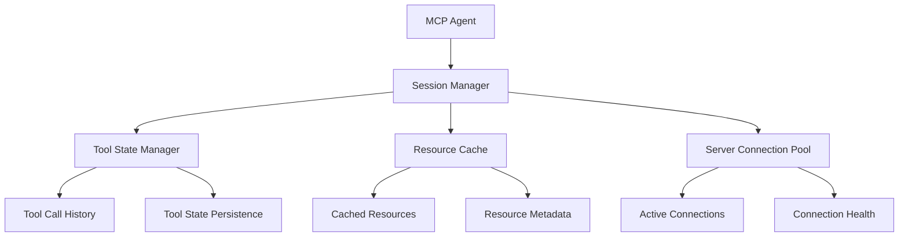

# MCP Session Integration with Session Management

This document describes how OpenMAS session management integrates with the Model Context Protocol (MCP), focusing on tool invocation, resource management, and stateful MCP interactions.

## Overview

The MCP protocol integration with session management provides:
- Tool state persistence across sessions
- Resource caching and management
- Prompt template session binding
- Server connection lifecycle management
- Multi-server session coordination

## MCP Session Architecture

### Session-MCP Relationship



### Core Components

1. **Tool State Manager**: Maintains tool execution state and history
2. **Resource Cache Manager**: Caches MCP resources within session scope
3. **Server Connection Manager**: Manages MCP server connections per session
4. **Prompt Session Binder**: Associates prompt templates with session contexts

## Configuration

### Basic MCP Session Configuration

```yaml
sessions:
  enabled: true
  protocol_sessions:
    mcp:
      enabled: true
      tool_management:
        enabled: true
        persist_tool_state: true
        tool_call_history: true
        max_tool_calls_per_session: 100
      resource_management:
        enabled: true
        cache_resources: true
        cache_ttl: 1800  # 30 minutes
        max_cached_resources: 50
      server_management:
        connection_pooling: true
        max_connections_per_session: 5
        connection_timeout: 30
        auto_reconnect: true
```

### Advanced MCP Session Configuration

```yaml
sessions:
  enabled: true
  protocol_sessions:
    mcp:
      enabled: true
      advanced_features:
        multi_server_sessions:
          enabled: true
          server_affinity: true
          load_balancing: "round_robin"
        tool_chaining:
          enabled: true
          max_chain_depth: 5
          auto_dependency_resolution: true
        resource_prefetching:
          enabled: true
          prefetch_strategy: "predictive"
          max_prefetch_resources: 20
        session_isolation:
          enabled: true
          isolated_server_connections: true
          separate_tool_namespaces: true
```

## Implementation Patterns

### 1. MCP Tool State Management

```python
from openmas.agent import BaseAgent
from openmas.protocols.mcp import MCPToolCall, MCPResource
from openmas.core.simf import SIMFMessage

class MCPSessionAgent(BaseAgent):
    def __init__(self, config):
        super().__init__(config)
        self.mcp_client = None
        self.tool_state_manager = None

    async def process_message(self, message: SIMFMessage) -> SIMFMessage:
        # Get MCP session context
        mcp_session = await self.get_mcp_session_context()

        # Check if message requires MCP tools
        if self.requires_mcp_tools(message):
            return await self.process_with_mcp_tools(message, mcp_session)
        else:
            return await super().process_message(message)

    async def process_with_mcp_tools(self, message: SIMFMessage, mcp_session) -> SIMFMessage:
        # Determine required tools based on message content
        required_tools = await self.analyze_tool_requirements(message)

        # Check tool availability in session
        available_tools = await mcp_session.get_available_tools()

        tool_results = {}

        for tool_name in required_tools:
            if tool_name in available_tools:
                # Execute tool with session state
                result = await self.execute_tool_with_session(
                    tool_name,
                    message,
                    mcp_session
                )
                tool_results[tool_name] = result

                # Update tool state in session
                await mcp_session.update_tool_state(tool_name, result)
            else:
                # Tool not available, handle gracefully
                tool_results[tool_name] = {
                    "error": f"Tool {tool_name} not available",
                    "fallback_used": True
                }

        # Generate response based on tool results
        response = await self.generate_response_from_tool_results(
            message,
            tool_results,
            mcp_session
        )

        # Update session with tool usage
        await mcp_session.log_tool_usage(required_tools, tool_results)

        return response

    async def execute_tool_with_session(self, tool_name: str, message: SIMFMessage, mcp_session) -> dict:
        """Execute MCP tool with session context"""

        # Get tool previous state from session
        previous_state = await mcp_session.get_tool_state(tool_name)

        # Prepare tool arguments with session context
        tool_args = await self.prepare_tool_arguments(
            tool_name,
            message,
            previous_state
        )

        # Create tool call
        tool_call = MCPToolCall(
            name=tool_name,
            arguments=tool_args,
            session_id=mcp_session.id
        )

        # Execute tool
        try:
            result = await self.mcp_client.call_tool(tool_call)

            # Store successful result
            await mcp_session.store_tool_result(tool_name, result, success=True)

            return result

        except Exception as e:
            # Handle tool execution error
            error_result = {"error": str(e), "tool": tool_name}
            await mcp_session.store_tool_result(tool_name, error_result, success=False)

            return error_result
```

### 2. Resource Caching and Management

```python
class MCPResourceManager:
    def __init__(self, session_manager, cache_config):
        self.session_manager = session_manager
        self.cache_config = cache_config
        self.resource_cache = {}

    async def get_resource_with_caching(self, resource_uri: str, session_id: str) -> MCPResource:
        """Get resource with session-aware caching"""

        # Create cache key with session context
        cache_key = f"{session_id}:{resource_uri}"

        # Check session-specific cache
        if cache_key in self.resource_cache:
            cached_resource = self.resource_cache[cache_key]

            # Check if cache is still valid
            if self.is_cache_valid(cached_resource):
                await self.update_cache_access_time(cache_key)
                return cached_resource["resource"]

        # Fetch resource from MCP server
        session = await self.session_manager.get_session(session_id)
        mcp_client = await session.get_mcp_client()

        try:
            resource = await mcp_client.read_resource(resource_uri)

            # Cache resource with session context
            await self.cache_resource(cache_key, resource, session_id)

            return resource

        except Exception as e:
            # If fetch fails and we have stale cache, use it
            if cache_key in self.resource_cache:
                stale_resource = self.resource_cache[cache_key]["resource"]
                await self.log_stale_cache_usage(cache_key, str(e))
                return stale_resource

            raise e

    async def cache_resource(self, cache_key: str, resource: MCPResource, session_id: str):
        """Cache resource with session metadata"""

        self.resource_cache[cache_key] = {
            "resource": resource,
            "cached_at": datetime.utcnow(),
            "session_id": session_id,
            "access_count": 1,
            "last_accessed": datetime.utcnow()
        }

        # Enforce cache size limits
        await self.enforce_cache_limits(session_id)

    async def invalidate_session_cache(self, session_id: str):
        """Invalidate all cached resources for a session"""

        keys_to_remove = [
            key for key, value in self.resource_cache.items()
            if value["session_id"] == session_id
        ]

        for key in keys_to_remove:
            del self.resource_cache[key]

    async def prefetch_resources(self, predicted_resources: List[str], session_id: str):
        """Prefetch resources that are likely to be needed"""

        session = await self.session_manager.get_session(session_id)
        mcp_client = await session.get_mcp_client()

        # Prefetch in parallel
        prefetch_tasks = [
            self.prefetch_single_resource(resource_uri, session_id, mcp_client)
            for resource_uri in predicted_resources
        ]

        await asyncio.gather(*prefetch_tasks, return_exceptions=True)

    async def prefetch_single_resource(self, resource_uri: str, session_id: str, mcp_client):
        """Prefetch a single resource"""
        try:
            resource = await mcp_client.read_resource(resource_uri)
            cache_key = f"{session_id}:{resource_uri}"
            await self.cache_resource(cache_key, resource, session_id)
        except Exception:
            # Ignore prefetch failures
            pass
```

### 3. Multi-Server Session Coordination

```python
class MCPMultiServerSession:
    def __init__(self, session_id: str, servers: List[str]):
        self.session_id = session_id
        self.servers = servers
        self.server_clients = {}
        self.server_tools = {}
        self.server_resources = {}
        self.load_balancer = MCPLoadBalancer()

    async def initialize_servers(self):
        """Initialize connections to all MCP servers"""

        for server_id in self.servers:
            try:
                # Create MCP client for this server
                client = await self.create_mcp_client(server_id)
                await client.initialize()

                self.server_clients[server_id] = client

                # Discover tools and resources
                tools = await client.list_tools()
                resources = await client.list_resources()

                self.server_tools[server_id] = tools
                self.server_resources[server_id] = resources

            except Exception as e:
                await self.log_server_initialization_error(server_id, str(e))

    async def execute_tool_across_servers(self, tool_name: str, arguments: dict) -> dict:
        """Execute tool on the best available server"""

        # Find servers that have this tool
        capable_servers = [
            server_id for server_id, tools in self.server_tools.items()
            if any(tool.name == tool_name for tool in tools)
        ]

        if not capable_servers:
            raise ValueError(f"No server found with tool: {tool_name}")

        # Select best server using load balancer
        selected_server = await self.load_balancer.select_server(
            capable_servers,
            criteria={"tool": tool_name, "load": True, "latency": True}
        )

        # Execute tool on selected server
        client = self.server_clients[selected_server]

        try:
            result = await client.call_tool(tool_name, arguments)

            # Update load balancer with success
            await self.load_balancer.record_success(selected_server, tool_name)

            return result

        except Exception as e:
            # Update load balancer with failure
            await self.load_balancer.record_failure(selected_server, tool_name, str(e))

            # Try failover to another server if available
            if len(capable_servers) > 1:
                fallback_servers = [s for s in capable_servers if s != selected_server]
                return await self.try_fallback_execution(
                    tool_name,
                    arguments,
                    fallback_servers
                )

            raise e

    async def get_resource_from_best_server(self, resource_uri: str) -> MCPResource:
        """Get resource from the server that has it and is performing best"""

        # Find servers that have this resource
        capable_servers = []
        for server_id, resources in self.server_resources.items():
            if any(resource.uri == resource_uri for resource in resources):
                capable_servers.append(server_id)

        if not capable_servers:
            raise ValueError(f"No server found with resource: {resource_uri}")

        # Select best server
        selected_server = await self.load_balancer.select_server(
            capable_servers,
            criteria={"resource": resource_uri, "bandwidth": True}
        )

        # Get resource from selected server
        client = self.server_clients[selected_server]

        try:
            resource = await client.read_resource(resource_uri)
            await self.load_balancer.record_success(selected_server, f"resource:{resource_uri}")
            return resource

        except Exception as e:
            await self.load_balancer.record_failure(selected_server, f"resource:{resource_uri}", str(e))

            # Try other servers
            if len(capable_servers) > 1:
                for fallback_server in capable_servers:
                    if fallback_server != selected_server:
                        try:
                            fallback_client = self.server_clients[fallback_server]
                            return await fallback_client.read_resource(resource_uri)
                        except Exception:
                            continue

            raise e
```

## Session State Management

### MCP Session State

```python
class MCPSessionState:
    def __init__(self, session_id: str):
        self.session_id = session_id
        self.tool_call_history = []
        self.tool_states = {}
        self.cached_resources = {}
        self.server_connections = {}
        self.session_metadata = {}

    async def log_tool_call(self, tool_name: str, arguments: dict, result: dict, success: bool):
        """Log a tool call in the session history"""

        call_record = {
            "tool_name": tool_name,
            "arguments": arguments,
            "result": result,
            "success": success,
            "timestamp": datetime.utcnow(),
            "call_id": str(uuid.uuid4())
        }

        self.tool_call_history.append(call_record)

        # Limit history size
        if len(self.tool_call_history) > 100:
            self.tool_call_history = self.tool_call_history[-100:]

        # Update tool state
        await self.update_tool_state(tool_name, result, success)

    async def update_tool_state(self, tool_name: str, result: dict, success: bool):
        """Update the persistent state for a tool"""

        if tool_name not in self.tool_states:
            self.tool_states[tool_name] = {
                "first_used": datetime.utcnow(),
                "call_count": 0,
                "success_count": 0,
                "failure_count": 0,
                "last_result": None,
                "last_success": None
            }

        state = self.tool_states[tool_name]
        state["call_count"] += 1
        state["last_result"] = result
        state["last_used"] = datetime.utcnow()

        if success:
            state["success_count"] += 1
            state["last_success"] = datetime.utcnow()
        else:
            state["failure_count"] += 1

    def get_tool_usage_summary(self) -> dict:
        """Get summary of tool usage in this session"""

        return {
            "total_tool_calls": len(self.tool_call_history),
            "unique_tools_used": len(self.tool_states),
            "tools_by_usage": sorted(
                [(tool, state["call_count"]) for tool, state in self.tool_states.items()],
                key=lambda x: x[1],
                reverse=True
            ),
            "success_rate": (
                sum(state["success_count"] for state in self.tool_states.values()) /
                max(1, sum(state["call_count"] for state in self.tool_states.values()))
            )
        }
```

## Testing MCP Session Integration

### Tool State Persistence Test

```python
@pytest.mark.asyncio
async def test_mcp_tool_state_persistence():
    # Create MCP session agent
    agent = MCPSessionAgent(config)

    # Start session
    session_id = await agent.start_session("test_user")

    # Execute tool multiple times
    message1 = SIMFMessage(content="Use calculator to add 2 + 3", protocol="mcp")
    result1 = await agent.process_message(message1, session_id=session_id)

    message2 = SIMFMessage(content="Use calculator to multiply result by 4", protocol="mcp")
    result2 = await agent.process_message(message2, session_id=session_id)

    # Verify tool state persistence
    session = await agent.get_session(session_id)
    mcp_state = await session.get_mcp_state()

    calculator_state = mcp_state.tool_states.get("calculator")
    assert calculator_state is not None
    assert calculator_state["call_count"] == 2
    assert calculator_state["success_count"] == 2
```

### Multi-Server Coordination Test

```python
@pytest.mark.asyncio
async def test_multi_server_mcp_coordination():
    # Create multi-server MCP session
    servers = ["server1", "server2", "server3"]
    multi_session = MCPMultiServerSession("test_session", servers)

    await multi_session.initialize_servers()

    # Test tool execution across servers
    result = await multi_session.execute_tool_across_servers(
        "data_processor",
        {"data": [1, 2, 3, 4, 5]}
    )

    assert result["success"] is True

    # Test resource retrieval
    resource = await multi_session.get_resource_from_best_server(
        "file://data/test.csv"
    )

    assert resource is not None
    assert resource.uri == "file://data/test.csv"
```

## Performance Optimization

### Connection Pooling

```yaml
# Optimized MCP session configuration
sessions:
  protocol_sessions:
    mcp:
      performance:
        connection_pooling:
          enabled: true
          pool_size: 20
          max_idle_connections: 5
          connection_timeout: 30
        tool_caching:
          enabled: true
          cache_tool_results: true
          cache_duration: 300  # 5 minutes
        resource_streaming:
          enabled: true
          stream_large_resources: true
          streaming_threshold: 1048576  # 1MB
```

### Load Balancing Strategy

```python
class MCPLoadBalancer:
    def __init__(self):
        self.server_metrics = {}
        self.strategy = "weighted_round_robin"

    async def select_server(self, available_servers: List[str], criteria: dict) -> str:
        """Select best server based on performance metrics"""

        if self.strategy == "weighted_round_robin":
            return await self.weighted_round_robin_selection(available_servers)
        elif self.strategy == "least_latency":
            return await self.least_latency_selection(available_servers)
        else:
            # Default to simple round robin
            return available_servers[0]

    async def weighted_round_robin_selection(self, servers: List[str]) -> str:
        """Select server using weighted round robin based on success rates"""

        weights = {}
        for server in servers:
            metrics = self.server_metrics.get(server, {"success_rate": 1.0})
            weights[server] = metrics["success_rate"]

        # Select based on weights
        total_weight = sum(weights.values())
        if total_weight == 0:
            return servers[0]

        # Weighted random selection
        import random
        r = random.uniform(0, total_weight)
        cumulative = 0

        for server, weight in weights.items():
            cumulative += weight
            if r <= cumulative:
                return server

        return servers[0]  # Fallback
```

## References

- [A2A Task Integration](./a2a_tasks.md)
- [MCP Protocol Specification](../../02_protocols/mcp/)
- [Session Management Design](../design_session_management.md)
- [Multi-Agent Sessions](../multi_agent_sessions.md)
- [MCP Agent Implementation](../../../src/openmas/agent/mcp_agent.py)
