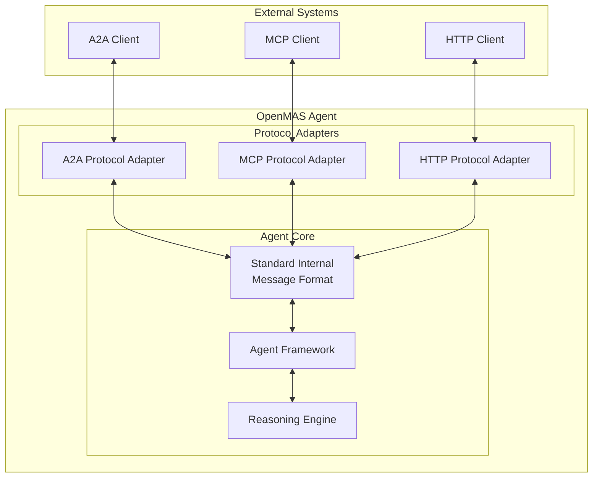

# Protocol Adapters in OpenMAS

## Overview

Protocol Adapters in OpenMAS are implementations of the [`IProtocolAdapter` interface](../../02_protocols/iprotocol_adapter_interface.md) that enable agents to communicate using specific protocols while maintaining protocol agnosticism in the agent core. They serve as the critical translation layer between protocol-specific message formats and OpenMAS's Standard Internal Message Format (SIMF).

## Architecture Role

Protocol Adapters are a key component of OpenMAS's multi-protocol architecture:



## IProtocolAdapter Interface

All protocol adapters must implement the `IProtocolAdapter` interface, which defines the contract for:

### Core Translation Methods

1. **`to_internal_format(protocol_message)`**
   - Converts protocol-specific messages to SIMF
   - Selects appropriate SIMF payload types based on message content
   - Preserves semantic information during translation

2. **`from_internal_format(internal_message)`**
   - Converts SIMF messages to protocol-specific formats
   - Translates SIMF payload types to protocol structures
   - Maintains message semantics across protocols

### Connection Management

3. **`connect()` and `disconnect()`**
   - Manages protocol connection lifecycle
   - Handles authentication and authorization
   - Manages connection state and error recovery

### Message Operations

4. **`send_message()` and `register_message_callback()`**
   - Handles message transmission and reception
   - Manages protocol-specific delivery semantics
   - Provides asynchronous message handling

### Status and Capabilities

5. **`get_status()` and `get_capabilities()`**
   - Provides protocol connection status
   - Exposes protocol-specific capabilities
   - Enables capability discovery and negotiation

## Supported Protocol Adapters

OpenMAS includes built-in adapters for major protocols:

### A2A (Agent-to-Agent) Protocol Adapter
- **Purpose**: Google's A2A protocol for agent communication
- **Features**: Agent cards, task management, multi-part messages
- **Transport**: HTTP, WebSocket, gRPC
- **Documentation**: [A2A Protocol Documentation](../../02_protocols/a2a/)

### MCP (Model Context Protocol) Adapter
- **Purpose**: Claude AI's Model Context Protocol
- **Features**: Tools, resources, prompts, streaming
- **Transport**: stdio, Server-Sent Events, HTTP streaming
- **Documentation**: [MCP Protocol Documentation](../../02_protocols/mcp/)

### HTTP Protocol Adapter
- **Purpose**: Standard HTTP/REST communication
- **Features**: RESTful APIs, webhooks, content negotiation
- **Transport**: HTTP/HTTPS
- **Documentation**: [HTTP Protocol Documentation](../../02_protocols/http/)

### MQTT Protocol Adapter
- **Purpose**: IoT and message queue communication
- **Features**: Pub/sub, QoS levels, retained messages
- **Transport**: MQTT over TCP/WebSocket
- **Documentation**: [MQTT Protocol Documentation](../../02_protocols/mqtt/)

### gRPC Protocol Adapter
- **Purpose**: High-performance RPC communication
- **Features**: Bidirectional streaming, strong typing
- **Transport**: gRPC over HTTP/2
- **Documentation**: [gRPC Protocol Documentation](../../02_protocols/grpc/)

## SIMF Payload Type Mapping

Protocol adapters map protocol-specific concepts to SIMF payload types:

| Protocol Feature | SIMF Payload Type | Description |
|------------------|-------------------|-------------|
| Text messages | `text_content` | Simple text communication |
| Structured data | `structured_data_content` | JSON, XML, or other structured formats |
| File attachments | `asset_reference_content` | References to binary assets |
| Multi-part messages | `multi_part_content` | Compound messages with multiple parts |
| Tool/capability calls | `invocation_content` | Function or capability invocations |
| Results/responses | `invocation_result_content` | Results from invocations |
| Streaming data | `stream_context_content` | Continuous data flow |
| Event notifications | `event_content` | State changes and events |
| Knowledge structures | `knowledge_representation_content` | Formal knowledge representations |

## Creating Custom Protocol Adapters

To add support for a new protocol:

### 1. Implement IProtocolAdapter

```python
from openmas.protocols import IProtocolAdapter
from openmas.core.simf import InternalMessageFormat

class CustomProtocolAdapter(IProtocolAdapter):
    """Custom protocol adapter implementation."""

    def __init__(self, config: Dict[str, Any]):
        self.config = config
        self.connection = None

    async def connect(self) -> bool:
        """Establish connection to the protocol."""
        # Implement protocol-specific connection logic
        pass

    async def disconnect(self) -> bool:
        """Close protocol connection."""
        # Implement protocol-specific disconnection logic
        pass

    def to_internal_format(self, protocol_message: Any) -> InternalMessageFormat:
        """Convert protocol message to SIMF."""
        # Analyze protocol message and select appropriate payload type
        # Create SIMF message with proper metadata
        pass

    def from_internal_format(self, internal_message: InternalMessageFormat) -> Any:
        """Convert SIMF message to protocol format."""
        # Extract payload and metadata from SIMF
        # Create protocol-specific message structure
        pass

    async def send_message(self, message: Any) -> str:
        """Send message using the protocol."""
        # Implement protocol-specific message sending
        pass

    def register_message_callback(self, callback: Callable) -> None:
        """Register callback for incoming messages."""
        # Set up protocol-specific message reception
        pass
```

### 2. Register as Extension

```python
from openmas.extensions import ProtocolAdapterExtension

class CustomProtocolExtension(ProtocolAdapterExtension):
    """Extension for custom protocol support."""

    extension_type = "protocol_adapter"
    protocol_type = "custom"

    def create_adapter(self, config: Dict[str, Any]) -> IProtocolAdapter:
        return CustomProtocolAdapter(config)
```

### 3. Configure in Schema

```yaml
extensions:
  custom_protocol:
    type: "protocol_adapter"
    enabled: true
    protocol_type: "custom"
    class: "mypackage.CustomProtocolExtension"
    options:
      endpoint: "custom://localhost:9000"
      authentication:
        type: "api_key"
        key: "${CUSTOM_PROTOCOL_KEY}"
```

## Best Practices

### Message Translation
1. **Preserve Semantics**: Ensure no semantic information is lost during translation
2. **Handle Edge Cases**: Account for protocol-specific limitations and edge cases
3. **Use Appropriate Payload Types**: Select SIMF payload types that best represent message content
4. **Maintain Metadata**: Preserve important protocol-specific metadata in SIMF

### Error Handling
1. **Graceful Degradation**: Handle protocol failures without affecting agent core
2. **Retry Logic**: Implement appropriate retry strategies for transient failures
3. **Clear Error Messages**: Provide detailed error information for debugging
4. **Fallback Mechanisms**: Support alternative protocols when possible

### Performance
1. **Asynchronous Operations**: Use async/await for all I/O operations
2. **Connection Pooling**: Reuse connections when possible
3. **Message Batching**: Batch messages for efficiency when supported
4. **Resource Management**: Properly manage protocol resources and connections

## Testing Protocol Adapters

### Unit Tests
- Test message translation accuracy
- Verify error handling scenarios
- Test connection lifecycle management
- Validate configuration handling

### Integration Tests
- Test with real protocol implementations
- Verify cross-protocol communication
- Test performance under load
- Validate security features

### Example Test
```python
import pytest
from openmas.testing import ProtocolAdapterTestHarness

@pytest.mark.asyncio
async def test_custom_protocol_adapter():
    """Test custom protocol adapter functionality."""
    harness = ProtocolAdapterTestHarness()
    adapter = CustomProtocolAdapter(test_config)

    # Test connection
    assert await adapter.connect()
    assert adapter.get_status().status == "connected"

    # Test message translation
    protocol_message = create_test_protocol_message()
    simf_message = adapter.to_internal_format(protocol_message)

    assert simf_message.payload.payload_type == "text_content"
    assert simf_message.payload.text == "expected content"

    # Test reverse translation
    reverse_message = adapter.from_internal_format(simf_message)
    assert reverse_message == protocol_message

    # Test cleanup
    assert await adapter.disconnect()
```

## Related Documentation

- [IProtocolAdapter Interface Specification](../../02_protocols/iprotocol_adapter_interface.md) - Complete interface definition
- [Standard Internal Message Format](../../01_architecture/internal_message_format_standard.md) - SIMF specification
- [Multi-Protocol Design](../../01_architecture/multi_protocol_design.md) - Overall architecture
- [Extension System](../extension_system.md) - Extension framework overview
- [Protocol Documentation](../../02_protocols/) - Individual protocol specifications
