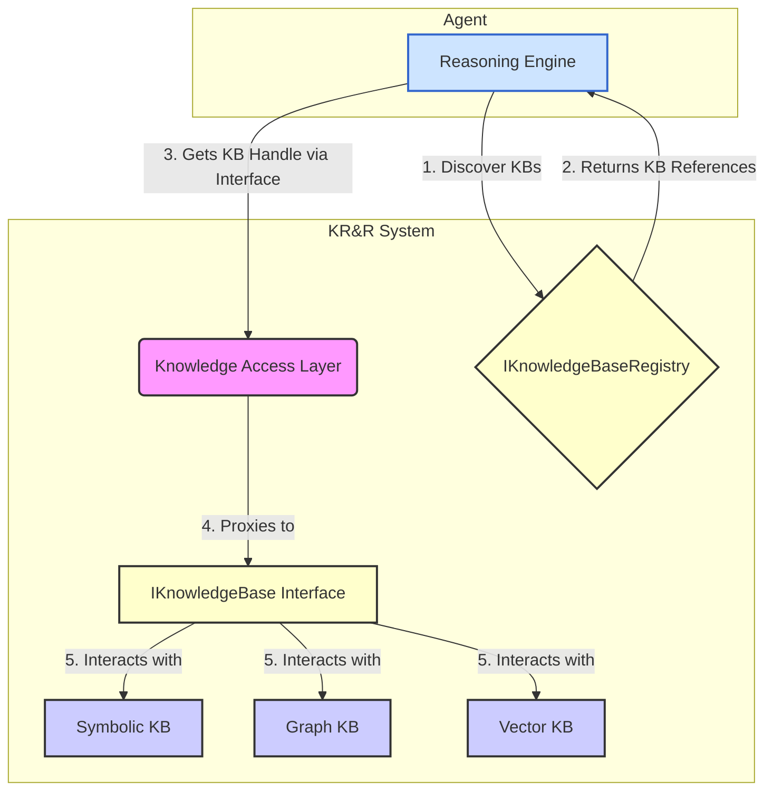

# Knowledge Representation & Reasoning (KR&R) System Architecture

## 1. Core Architectural Principles

The KR&R System in OpenMAS is built on a fundamental principle: the strict **separation of knowledge management from agent reasoning**. This means:

-   **The KR&R System** is responsible for the lifecycle of knowledge: its storage, retrieval, consistency, and access control. It acts as a specialized service provider.
-   **Reasoning Engines** are the consumers of this service. They contain the agent's primary decision-making logic (the "brain") and query the KR&R System to get the information they need to operate.

This separation is the cornerstone of OpenMAS's **reasoning-agnostic design**, allowing any type of reasoning engine (e.g., LLM-based, BDI, rule-based) to be paired with any supported knowledge representation without requiring changes to either component.

## 2. Key Components

The KR&R architecture consists of the following key components:

-   **Knowledge Bases (KBs)**: These are the concrete implementations that store knowledge. Each KB can use a different representation formalism (e.g., a symbolic store, a graph database, a vector store for embeddings).
-   **`IKnowledgeBase` Interface**: A standardized, representation-agnostic interface that defines the contract for interacting with any Knowledge Base. It abstracts the specific implementation details of the underlying store, providing common methods for querying, asserting, and retracting facts.
-   **`IKnowledgeBaseRegistry`**: A service registry that allows agents to discover available `IKnowledgeBase` instances at runtime. This enables dynamic binding between an agent's reasoning engine and the knowledge sources it needs.
-   **Knowledge Access Layer**: This is the logical layer that exposes the `IKnowledgeBase` and `IKnowledgeBaseRegistry` interfaces to the rest of the framework, managing the connections and routing requests to the appropriate KB implementation.

## 3. Architectural Flow Diagram

The following diagram illustrates how a Reasoning Engine interacts with the KR&R System:

### Interaction Steps:

1.  **Discovery**: The `Reasoning Engine` queries the `IKnowledgeBaseRegistry` to discover available knowledge bases, potentially filtering by name, type, or metadata.
2.  **Reference**: The registry returns handles or references to the desired `IKnowledgeBase` instances.
3.  **Access**: The `Reasoning Engine` uses the returned handle to request access to a specific KB through the `Knowledge Access Layer`.
4.  **Proxying**: The `Knowledge Access Layer` provides a proxy object that implements the `IKnowledgeBase` interface.
5.  **Interaction**: The `Reasoning Engine` interacts with the KB using the standardized methods of the `IKnowledgeBase` interface (e.g., `query()`, `assert()`). The interface implementation translates these calls into the specific operations required by the underlying data store (Symbolic, Graph, Vector, etc.).

## 4. Extensibility

The architecture is designed for extensibility. New knowledge representations can be integrated into OpenMAS by:

1.  Creating a new Knowledge Base implementation.
2.  Implementing the `IKnowledgeBase` interface for that new KB.
3.  Providing a mechanism for the `IKnowledgeBaseRegistry` to discover and register the new KB type, typically through the extension system.
