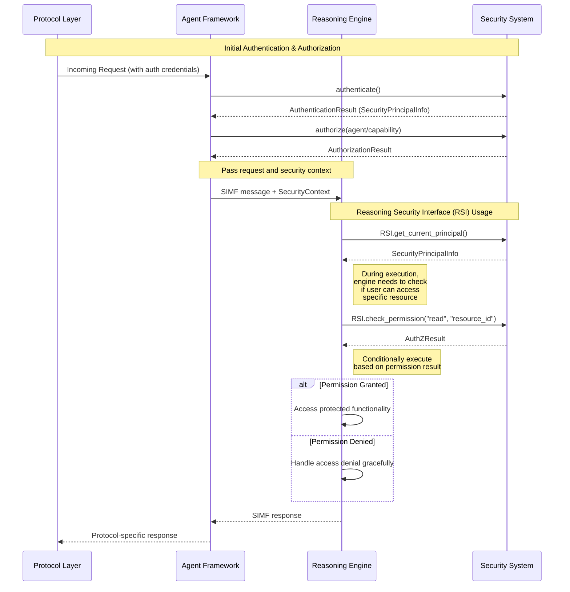

# Reasoning Security Interface (RSI)

## Introduction

The Reasoning Security Interface (RSI) is a key component of OpenMAS's security architecture that enables `ReasoningEngines` (the agent "brain") to interact with the OpenMAS Security System. While the primary authentication and authorization for agent requests are handled by the Protocol Layer and Agent Framework, the RSI allows reasoning components to perform fine-grained security checks and access authenticated principal information during their execution.

This interface is designed to maintain OpenMAS's core architectural principle of body-brain separation while providing reasoning engines with the security context they need to make informed decisions that respect security boundaries.

## Core Principles

The RSI is designed with the following principles in mind:

1. **Optionality**: The RSI is available for reasoning engines that need security context, but not all reasoning engines are required to use it. This maintains flexibility in the OpenMAS ecosystem.

2. **Granularity**: The RSI enables fine-grained, context-specific security decisions *within* a reasoning process, beyond the coarse-grained permissions that are checked at the agent/capability invocation level.

3. **Maintaining Body-Brain Separation**: The RSI upholds the separation between the agent's communication infrastructure ("body") and decision-making logic ("brain"). The Agent Framework still handles primary authentication and authorization, while the RSI allows the "brain" to *query* the security system without breaking this separation.

4. **Consistency**: The RSI provides a standard interface for different types of reasoning engines (LLM-based, rule-based, BDI, etc.) to interact with security services, ensuring consistent security behavior across different reasoning approaches.

5. **Least Privilege**: The RSI follows the principle of least privilege by allowing reasoning engines to check specific permissions without granting them broad access to the security system.

## Interface Definition

The RSI is defined as an abstract interface that all security-aware reasoning engines can access. Below is the interface definition in Python-like pseudocode:

```python
class ReasoningSecurityInterface:
    """Interface for reasoning engines to interact with the security system."""

    def get_current_principal(self) -> SecurityPrincipalInfo:
        """
        Returns information about the authenticated principal for the current agent request context.

        Returns:
            SecurityPrincipalInfo: A structured object containing information about the authenticated principal

        Raises:
            SecurityContextError: If no security context is available for the current request
        """
        pass

    def check_permission(
        self,
        action: str,
        resource_identifier: str,
        context: Optional[Dict] = None
    ) -> AuthZResult:
        """
        Checks if the current principal has permission to perform the specified action on the specified resource.

        Args:
            action: The action to check permission for (e.g., "read", "write", "execute")
            resource_identifier: The identifier of the resource to check permission for
            context: Optional additional context for the permission check

        Returns:
            AuthZResult: The result of the authorization check

        Raises:
            SecurityContextError: If no security context is available for the current request
            InvalidActionError: If the specified action is not recognized
            InvalidResourceError: If the specified resource is not recognized
        """
        pass
```

### SecurityPrincipalInfo Structure

```python
class SecurityPrincipalInfo:
    """Information about an authenticated security principal."""

    id: str  # Unique identifier for the principal
    type: str  # Type of principal (e.g., "user", "agent", "service")
    name: Optional[str]  # Human-readable name
    roles: List[str]  # Roles assigned to the principal
    attributes: Dict[str, Any]  # Additional attributes of the principal
    authentication_time: datetime  # When the principal was authenticated
    authentication_method: str  # Method used to authenticate the principal
    issuer: Optional[str]  # Entity that issued the authentication

    # Additional methods may be provided to query specific aspects of the principal
    def has_role(self, role: str) -> bool:
        """Check if the principal has the specified role."""
        return role in self.roles

    def get_attribute(self, name: str, default: Any = None) -> Any:
        """Get the value of a specific attribute."""
        return self.attributes.get(name, default)
```

### AuthZResult Structure

```python
class AuthZResult:
    """Result of an authorization check."""

    allowed: bool  # Whether the action is allowed
    reason: str  # Reason for the decision
    decision_factors: Dict[str, Any]  # Factors that influenced the decision
    timestamp: datetime  # When the decision was made

    def is_allowed(self) -> bool:
        """Check if the action is allowed."""
        return self.allowed
```

## Interaction Flow

The following diagram illustrates how a `ReasoningEngine` typically interacts with the RSI:




The flow is as follows:

1. An incoming request with authentication credentials is received by the Protocol Layer and passed to the Agent Framework.
2. The Agent Framework authenticates the request by calling the Security System's authentication service.
3. The Security System returns an `AuthenticationResult` containing a `SecurityPrincipalInfo` object.
4. The Agent Framework then authorizes the specific agent/capability invocation by calling the Security System's authorization service.
5. If authentication and authorization are successful, the Agent Framework passes the request (as SIMF), along with the security context, to the appropriate `ReasoningEngine`.
6. During execution, the `ReasoningEngine` can call `RSI.get_current_principal()` to access information about the authenticated principal.
7. The `ReasoningEngine` can also call `RSI.check_permission()` to check if the principal has permission to perform specific actions on specific resources.
8. Based on these security checks, the `ReasoningEngine` can make informed decisions about how to proceed with its execution.

## Configuration Aspects

The RSI usage by reasoning engines is configured in the agent's configuration as follows:

```yaml
agents:
  agent_name:
    # ... other agent configuration ...
    reasoning:
      approach: "llm"  # or "rule_based", "bdi", etc.
      # ... other reasoning configuration ...
      security_integration:
        rsi_enabled: true  # Whether this reasoning engine should use RSI
        rsi_policy_profile: "standard"  # Link to a set of fine-grained permissions
        permission_check_behavior: "strict"  # How to handle permission check failures
```

The `rsi_policy_profile` refers to a predefined set of permissions that the reasoning engine is allowed to check via the RSI. This provides an additional layer of security by restricting which permissions a reasoning engine can query.

The `permission_check_behavior` determines how the reasoning engine should behave when a permission check fails. Options include:
- `strict`: Fail the entire reasoning process if a permission check fails
- `warn`: Continue but log a warning
- `permissive`: Continue and let the reasoning engine decide how to handle the failure

## Examples of Use Cases

### Example 1: LLM Reasoner with Tool Usage Permission Checks

An LLM-based reasoning engine can use the RSI to check if the current principal has permission to use specific tools:

```python
def decide_action(self, context):
    # Get the current principal
    principal = self.rsi.get_current_principal()

    # Log the principal for traceability
    self.logger.info(f"Processing request for principal: {principal.id} ({principal.type})")

    # Determine what tools might be useful for this request
    potential_tools = self.tool_selector.select_tools(context.request)

    # Filter tools based on permissions
    allowed_tools = []
    for tool in potential_tools:
        # Check if the principal has permission to use this tool
        result = self.rsi.check_permission(
            action="use_tool",
            resource_identifier=f"tool:{tool.id}",
            context={"request_context": context.metadata}
        )

        if result.is_allowed():
            allowed_tools.append(tool)
        else:
            self.logger.warning(f"Principal {principal.id} denied access to tool {tool.id}: {result.reason}")

    # Proceed with reasoning using only the allowed tools
    response = self.llm.generate_response(context.request, allowed_tools=allowed_tools)
    return response
```

### Example 2: BDI Reasoner with Knowledge Access Checks

A BDI (Belief-Desire-Intention) reasoning engine can use the RSI to check if the current principal has permission to access specific knowledge resources:

```python
def update_beliefs(self, new_perceptions):
    principal = self.rsi.get_current_principal()

    updated_beliefs = {}

    # For each perception, check if related knowledge can be accessed
    for perception in new_perceptions:
        # Determine what knowledge domains are relevant to this perception
        relevant_domains = self.knowledge_mapper.map_perception_to_domains(perception)

        for domain in relevant_domains:
            # Check if the principal has permission to access this knowledge domain
            result = self.rsi.check_permission(
                action="access_knowledge",
                resource_identifier=f"knowledge_domain:{domain}",
                context={"perception_type": perception.type}
            )

            if result.is_allowed():
                # Access the knowledge and update beliefs
                knowledge = self.knowledge_base.query(domain, perception.query)
                updated_beliefs[domain] = self.belief_updater.integrate(perception, knowledge)
            else:
                self.logger.warning(f"Knowledge access denied: {result.reason}")

    return updated_beliefs
```

### Example 3: Rule-Based Reasoner with Action Permission Checks

A rule-based reasoning engine can use the RSI to check if the current principal has permission to execute specific actions:

```python
def apply_rules(self, facts):
    principal = self.rsi.get_current_principal()

    # Apply rules to determine possible actions
    possible_actions = self.rule_engine.evaluate(facts)

    # Filter actions based on permissions
    authorized_actions = []
    for action in possible_actions:
        # Check if the principal has permission to perform this action
        result = self.rsi.check_permission(
            action="execute_action",
            resource_identifier=f"action:{action.type}",
            context={"action_parameters": action.parameters}
        )

        if result.is_allowed():
            authorized_actions.append(action)

    return authorized_actions
```

## Limitations and Considerations

1. **Performance Overhead**: Each call to the RSI methods may introduce some performance overhead. Reasoning engines should be designed to minimize unnecessary security checks.

2. **Security Context Availability**: The RSI relies on the availability of a security context from the current request. In scenarios where there is no clear request context (e.g., background processing), the RSI may not be able to provide meaningful security information.

3. **Caching Considerations**: For performance reasons, reasoning engines might want to cache the results of permission checks. However, this should be done carefully to ensure that security decisions are still made with the most up-to-date information.

4. **Separation of Concerns**: While the RSI allows reasoning engines to access security information, they should not become overly dependent on security details. The primary responsibility for security enforcement still lies with the Agent Framework and Security System.

## Related Documentation

- [Security Principles](./architecture/security_principles.md)
- [Authentication Mechanisms](./authentication/auth_mechanisms.md)
- [Authorization Models](./authorization/authorization_models.md)
- [Agent Framework ↔ Security System Integration](../01_architecture/component_interoperability/interactions/agent_framework_security_system.md)
- [Reasoning Agnostic Design](../01_architecture/reasoning_agnostic_design.md)
